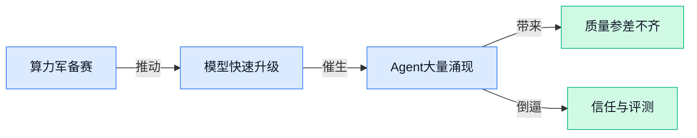

> AI 早报 · 每日早读 · 全网深度聚合

## **今日摘要**

```
Amazon联手Anthropic直冲5吉瓦级算力，Claude Opus 4.7与Claude Design同日登场
Google计划豪掷近200万颗AI芯片转投Marvell（美国芯片设计公司），台积电N3扩产却更显谨慎
OpenAI被曝按prompt relevance售卖ChatGPT广告位，Deezer（音乐流媒体平台）称44%新歌由AI生成
```

### 🔵 产品与功能更新

1. **Anthropic 推出 Claude Design（Claude 的视觉创作功能），想把做图流程进一步简化。**
这次更新的重点不是“让 AI 更会说”，而是让 Claude 更适合做**视觉内容生成**与创意整理 🎨。对不懂设计软件的同事来说，这类功能的意义很直接：把想法用自然语言说出来，AI 就能更快帮你产出可用的视觉方案，降低从“脑中有想法”到“手里有初稿”的门槛。它本质上更像把生成式设计能力塞进对话界面里，让**文案、运营、市场**团队也更容易上手。可参考这则[功能发布报道(briefing)](https://news.google.com/rss/articles/CBMiigFBVV95cUxNbERxdWRudm5CbXIwTEZGQ0l5ZGc3MmtiMnUwcHQtRzEwVlp4Y2hTa3JUODBXRjdrT3ZiS3B1Nm40cEZLNHRGRXF4R2YzWXhPZlYwaWV3czVWNnotTWxzYjlIYTJ2ZExYNXphSFRsQnZwRjNUajNOVjcwV3lYcWxRdWlqbmdXUnJrMFE?oc=5) 💡

2. **Amazon 与 Anthropic 达成新合作，为 Claude 提供最高 5 吉瓦级算力（相当于超大规模数据中心的电力与计算资源）。**
这条消息看起来偏基础设施，但其实和产品能力关系非常大：**算力**越充足，Claude 这类大模型的训练和服务能力就越有保障 ⚙️。报道提到最高 **5 gigawatts（5 吉瓦级电力规模，常用来衡量超大型 AI 数据中心建设体量）**，说明双方在长期扩张 Claude 背后的**计算资源**投入上动作很大。对普通用户和企业客户来说，这通常意味着未来模型更新、响应规模和企业级服务承载能力更值得关注。详情可看[合作消息报道(briefing)](https://news.google.com/rss/articles/CBMi2AFBVV95cUxQUEJyZ1ZHNFNnTFhvQURJRDV5TFl2bjVSZk81Z0U3aDhPRG8zT0dxcUFPeV9COHBDZi1tdEhDT2tLQ2FsMGJFZ19mclJuVjI3VV91MVUzRXhTcWZlYVMxYkZjWVB4TVRHRjd1d05iRU9aSy1uR1hjckxjN3VhRlpyXzBTRlR0WlNMZ1hYd1VuSFRJZ1dwRXVNaGI4ME02U2oyaHZvMjRiQVJqU3RNRndNSWlRem9FT25XbWxUY1RfdjVlRjFWSWx1VGZnb2hjOHV4ckwzWk8tdHQ?oc=5) 🚀

3. **Anthropic 发布 Claude Opus 4.7（Claude 高端模型的新版本）。**
从名称看，**Opus** 是 Claude 产品线里更偏高性能的一档，而 **4.7** 则意味着该模型又迎来一次版本迭代 🔄。这类更新通常值得业务团队关注，因为模型升级往往会影响**回答质量、复杂任务处理能力**以及企业接入时的体验稳定性；哪怕界面变化不大，底层能力的提升也可能直接改变使用效果。对已经在工作中用 Claude 写方案、总结资料或处理长文本的同事来说，新版本值得留意后续实测反馈。可查看这则[模型更新报道(briefing)](https://news.google.com/rss/articles/CBMiiAFBVV95cUxPLVM3WVdDS1N4RWE4MGxrOEZIcTNiUFlENHNkQUtMbHlwV2xVZXVEUnNORERXSGpyX19uYU9FLXg0UVFUVlJhdk1kLWpVYVpxbjRPNk84bVd4cEI1SXBTVnFaY3dfZkluY0J2TTBjcGozeVhFZHdlREVOOGZ6TDNBYlBBQjRvLUlu?oc=5) 💡

### 🟢 前沿研究

1. **Cut Your Losses!（一种让模型尽早砍掉错误思路的推理方法）想让并行推理少走弯路。**
这篇论文盯上了**并行推理**（让模型同时尝试多条思路来解题）里最烧钱的一环：很多错误路径其实一开始就已经“走偏”，后面继续算只是白白浪费算力 💸。作者提出要在**前缀级 pruning（前缀级裁剪，也就是答案刚起头时就判断这条思路值不值得继续）**尽早止损，从而提升**Large Reasoning Models（大型推理模型，专门强化复杂思考能力的大模型）**的效率。对企业来说，这类研究的意义很直接——如果未来落地成熟，同样复杂的问题可能用更低成本跑出差不多的结果。可查看 [arXiv 论文原文(briefing)](https://arxiv.org/abs/2604.16029) 或 [HuggingFace 论文页(briefing)](https://huggingface.co/papers/2604.16029)

2. **(1D) Ordered Tokens（把输出顺序重新排布的一种生成思路）让测试时搜索更高效。**
这项研究关注 **test-time search（测试时搜索，指模型在真正回答问题时边想边试多种候选解）** 的效率问题，核心想法是通过 **ordered tokens（有序 token，按特定顺序组织模型输出的最小文字单元）** 来减少无效探索 🔍。通俗说，就是不只关心“模型会不会答”，还关心“模型答题时怎么走步骤更省”。这类工作对需要高质量推理的产品很重要，因为它可能影响模型在正式使用时的速度、成本和稳定性。更多可看 [论文介绍页(briefing)](https://huggingface.co/papers/2604.15453)

3. **GTA-2（通用工具型 Agent 的评测基准）开始系统衡量 AI 从单步调用到开放式工作流的能力。**
这篇工作不是在造新模型，而是在补一个很关键的“尺子”：怎么更全面地评估 **General Tool Agents（通用工具型 Agent，能调用外部工具完成任务的 AI 助手）**。它把能力范围从 **atomic tool-use（原子级工具调用，也就是单一步骤的工具使用）** 一直拉到 **open-ended workflows（开放式工作流，目标明确但过程不固定的多步骤任务）**，更接近真实办公和业务场景 🧩。这意味着行业以后比较 Agent，不再只是看它会不会点按钮，而是看它能不能把一整套事情顺下来做完。详情见 [HuggingFace 论文页(briefing)](https://huggingface.co/papers/2604.15715)

4. **The Amazing Agent Race（Agent 能力竞赛研究）指出：AI 很会用工具，但不一定会“找路”。**
这篇论文标题很有画面感，核心结论也很直白：很多 **tool users（工具使用型 Agent，擅长调用搜索、浏览器、软件接口的 AI）** 已经不弱，但在 **navigation（导航，这里指在网页、任务流程或信息空间里找到正确路径）** 上仍然偏弱 🧭。换句话说，AI 可能会按按钮，却未必总能找到该去哪里、下一步该点什么。对业务同事来说，这提醒我们：现在很多 Agent 演示看起来很聪明，但一旦任务环境变复杂、页面结构多变，稳定性可能就会掉下来。原文可看 [论文摘要页(briefing)](https://huggingface.co/papers/2604.10261)

5. **VEFX-Bench（通用视频编辑与视觉特效评测基准）想给 AI 视频编辑立一套更完整的评分标准。**
随着 AI 视频越来越热，行业缺的不只是“能生成”，还缺“怎么公平比较谁做得更好”。这篇论文提出 **VEFX-Bench**，面向 **generic video editing（通用视频编辑）** 和 **visual effects（视觉特效，也就是给画面增加风格化或合成效果）** 做整体评测 🎬。它的价值在于帮助研究者和产品团队判断：一个模型到底只是会做酷炫片段，还是能稳定完成更贴近真实需求的视频修改任务。更多信息见 [HuggingFace 论文页(briefing)](https://huggingface.co/papers/2604.16272)

6. **PRL-Bench（评估大模型做前沿物理研究能力的基准）把 AI 拉到更硬核的科研考场。**
这项工作聚焦 **LLMs（大语言模型，能理解和生成文字的大模型）** 在 **frontier physics research（前沿物理研究）** 里的表现，不再满足于普通问答，而是看它能不能应对更专业、更研究导向的问题 🧪。对外行同事来说，可以把它理解成：AI 不只是拿来写邮件、做总结，研究界也在认真测试它能不能进入高门槛知识工作。这样的基准如果持续完善，未来会帮助大家更清楚地区分“会说”与“真懂”之间的差别。详情见 [论文介绍页(briefing)](https://huggingface.co/papers/2604.15411)

7. **Qwen3.5-Omni（通义千问新一代全模态模型）的技术报告发布。**
从标题看，这是一份 **technical report（技术报告，通常用来系统介绍模型设计、训练和能力边界的正式文档）**，对应的是 **Omni（全模态，表示模型可同时处理多种信息形态，如文字、图像、音频、视频）** 方向的新进展 📘。这类报告的重要性在于，它往往不只是“宣布有新模型”，而是把模型能做什么、怎么做、适合哪些场景说得更清楚。对公司内部关注产品能力演进的同事来说，这类文档常常比营销介绍更值得看，因为它更接近真实能力说明。可查看 [HuggingFace 技术报告页(briefing)](https://huggingface.co/papers/2604.15804)

### 🟡 行业展望与社会影响

1. **Google 计划新增近 200 万颗 AI 芯片，并转向 Marvell（美国芯片设计公司）定制方案。**
这件事最值得关注的，不只是 **Google** 要买更多芯片，而是它在加速把算力（支撑大模型训练和运行的计算资源）掌握在自己手里 💡。报道提到 Google 计划部署近两百万颗新 **AI 芯片**，并与 Marvell 合作做 **定制芯片**，说明大厂不再只拼模型，也在拼“谁能更稳定、更便宜地拿到算力” 🚀。对行业来说，这会进一步推高 **自研硬件** 和供应链竞争，未来 AI 成本、交付速度、平台控制权都可能因此被改写。[完整报道(briefing)](https://the-decoder.com/google-plans-nearly-two-million-new-ai-chips-as-it-turns-to-marvell-for-custom-designs/)


2. **Anthropic 与 Amazon 扩大合作，瞄准最高 5 吉瓦级算力（接近超大数据中心电力规模）。**
这条消息传递出一个很现实的信号：AI 竞争已经进入“**拼电、拼机房、拼基础设施**”的新阶段 ⚡。所谓 **5 吉瓦级算力**，本质上是在说未来支撑模型训练与 inference（模型推理，让训练好的模型真正回答问题、处理任务的过程）需要极其庞大的电力和服务器资源，不再只是写代码和调模型那么简单。对普通企业员工来说，这意味着未来领先 AI 产品背后，越来越取决于谁能长期拿到足够的能源、芯片和云资源；而 Amazon 继续加码，也说明 **Anthropic** 在商业和基础设施层面的重要性正在快速上升。[合作消息报道(briefing)](https://news.google.com/rss/articles/CBMiZkFVX3lxTE5fdy1yMjdvS1NvTl9pS3h1ck56aG0wRERDMy0yeDJJNmdJdEd0Z3I4N0xYS3RlY3AxWmtBR25FSkpPUWNrM0M1U1RxT0lPTXhja1prTGw4RGNNOHIweHdvcXd3Nk1DUQ?oc=5) [追加投资报道(briefing)](https://news.google.com/rss/articles/CBMiqgFBVV95cUxOdENHZTV6MTdDdGFScHBGUTJEandaV2pqb3ZJWWFVTHpJNUtsNWJJUVBWZFQyQ05MSWVYOFcwQ05Keks4R1FEWVNENkw4VTRHOEZjXzkwLUNIZ1pjd1ZRNUpfSmVFZTZWQ21HX09jQzdUSUJhS1lDTzZPWFg2QmpVeWhZdHlOZGRoVVRkOEdOZzNSNWFDRjFMSTZXdk1LX2ZjcFVJWmZ1YUQ3d9IBrwFBVV95cUxNVWN2VjU0RFV1OFl6R1cyVXlpQ2JKaTdfQndJQzBuZ0tuQVZlUUJJQ09WMDAwY2NYdk51UWdyZElSTGkwZHVXX1JPSVBTWE5rbzBURWRGaFhtZHR1OFN5WXJvRlA3RlMtX2Z5SjRnTGRZZjFkVDRtcTFtZmNobVk2MzRwNDdHUkZpdl92c21HUkF6eWZrSjFTUTRSWmdNajhpcW1MSm9OTmU1THpGRlJF?oc=5)

3. **NSA 采用 Anthropic 的 Mythos（Anthropic 面向高安全场景的强力模型），AI 正更深进入情报系统。**
报道显示，美国国家安全局 **NSA** 正在使用 Anthropic 的 **Mythos**，这说明最先进的大模型已不只服务客服、写作和办公，而是进入 **国家安全** 与网络防务场景 🛰️。这类应用通常要求更强的可靠性、权限控制和 alignment（对齐，让模型行为尽量符合人类规则与目标的训练过程），也意味着 AI 正从“提高效率工具”变成“关键机构能力的一部分”。对社会层面来说，这会持续拉高外界对 **AI 监管、军用边界、数据安全** 的讨论热度，普通人未来也会更频繁看到 AI 与公共安全议题绑定出现。[The Decoder 报道(briefing)](https://the-decoder.com/the-nsa-is-using-anthropics-most-powerful-ai-model-mythos/) [TechCrunch 跟进报道(briefing)](https://techcrunch.com/2026/04/20/nsa-spies-are-reportedly-using-anthropics-mythos-despite-pentagon-feud/)

4. **Anthropic 营收猛增，外界开始讨论其“万亿美元估值”。**
这条消息反映出一个趋势：资本市场正在把顶级 AI 公司看作下一代“基础平台公司”，而不只是新创软件公司 📈。报道提到 Anthropic 的 **营收激增** 正推高对其估值的想象空间，这背后说明企业客户对大模型服务、API（应用程序接口，让企业系统能直接调用 AI 能力的连接口）和长期合作的需求仍在快速增长。对行业而言，估值预期越高，越会吸引更多资金继续流向模型、芯片、云服务和人才争夺；但同时也意味着市场对这些公司的商业化兑现速度会提出更高要求。[估值讨论报道(briefing)](https://the-decoder.com/anthropics-revenue-surge-reportedly-fuels-talk-of-trillion-dollar-valuation/)

5. **Deezer（音乐流媒体平台）称 44% 的新上传歌曲由 AI 生成，且多数播放量涉嫌造假。**
这条新闻把 **AI 内容泛滥** 的另一面直接摆到了台前：生产门槛大幅降低后，平台治理压力也会同步飙升 🎵。Deezer 表示，新上传音乐中有 44% 来自 AI 生成，而且大多数流量被认定为 **欺诈性播放**，这意味着 AI 不只是帮人创作，也可能被用来批量制造“看起来有人听”的假内容。对内容平台、品牌方和广告主来说，这会直接影响 **版权判断、收益分配、数据真实性**；未来大家看到的“爆款数据”，也会越来越需要先问一句：这到底是真人喜欢，还是机器刷出来的？[完整报道(briefing)](https://news.google.com/rss/articles/CBMitwFBVV95cUxNY2h2amlFa2JicGVFX1FMaG10bUc3ZlJXN19pN3VnbFVfVjl0WW04WTFSQUd1a0RhX3RWZy1VN1R4RS0yRnROZnlwVUQ2dTJlWWJ0VFR1ZEFEUHhzWnpYMzQwamZESmdHcUJGSkF6TGt3LV8yaTVraDl6UlI4NmhmSDIxcUZONXJ1WFhmSWZ3VlFPZU5YeThOTzBpbU5WbzdMdEt5eW1WVWJRUElVaWg5cG1rcl9iU1k?oc=5)

### 🟣 开源TOP项目

1. **openclaude（一款开源的命令行 AI 编程助手）让一个工具接入 200 多种模型。**
这个项目主打 **CLI（命令行界面，用输入文字命令的方式操作电脑）** 里的编程协作，能对接 OpenAI、Gemini、DeepSeek、Ollama（本地运行大模型的工具）以及 GitHub Models（GitHub 提供的模型调用服务）等多种来源 🚀。对团队来说，它的意义是把原本分散在不同平台的 AI 编码能力，尽量收拢到一个统一入口里，减少来回切换。尤其是已经在用多家模型做比价、测试或分工的同事，会更容易搭起自己的 **coding agent（自动执行编程任务的 AI 助手）** 工作流。[GitHub 项目页(briefing)](https://github.com/Gitlawb/openclaude)


2. **awesome-claude-code（Claude Code 生态资源清单）把常用能力一次性打包汇总。**
这不是单一工具，而是一份面向 Claude Code 的精选资源库，整理了 **skills（可复用的任务能力模板）**、**hooks（在特定步骤自动触发的小机制）**、**slash-commands（斜杠命令，用 / 开头快速触发动作）**、插件和应用等内容 💡。对不想从零摸索的团队来说，这类项目很像“现成工具箱”，能快速了解 Claude Code 目前有哪些成熟玩法。它特别适合运营、产品、技术协作团队拿来找灵感，看看 AI 编码助手还能怎么嵌进日常流程。[资源清单仓库(briefing)](https://github.com/hesreallyhim/awesome-claude-code)


3. **MemPalace（一套开源 AI 记忆系统）想解决 Agent“聊完就忘”的老毛病。**
项目介绍里强调它是经过较好基准测试（用统一测试集比较系统表现）的开源 **AI memory system（AI 记忆系统，帮助手记住历史信息与上下文）**，而且可免费使用 🧠。这类能力对 Agent 特别重要，因为很多自动化任务都不是一句话能完成，AI 需要持续记住用户偏好、历史操作和任务状态。对企业场景来说，谁能把“短期对话”变成“长期记忆”，谁就更有机会把客服、销售支持、内部知识助手做得更顺手。[项目主页(briefing)](https://github.com/MemPalace/mempalace)


4. **claude-skills（Claude Code 技能与插件大全）把编程 Agent 扩展到营销、产品和管理场景。**
这个仓库收录了 232+ 个 **skills（预设能力模板，让 AI 更快进入某类任务）** 和 **agent plugins（Agent 插件，用来扩展 AI 助手功能的组件）**，不仅支持 Claude Code，也覆盖 Codex、Gemini CLI（Gemini 的命令行工具）和 Cursor 等多种编码助手 ✨。更有意思的是，它强调的不只是工程开发，还包括 **marketing（市场营销）**、产品、合规和 **C-level advisory（高管决策支持）** 等场景。换句话说，AI 编码助手的外延正在变大，开始从“写代码”走向“辅助业务角色完成复杂工作”。[技能仓库主页(briefing)](https://github.com/alirezarezvani/claude-skills)

5. **openai-agents-python（OpenAI 的多 Agent 开发框架）主打轻量但能撑起复杂协作流程。**
这是一个面向 Python（最流行的 AI 开发语言）的 **framework（框架，开发者用来快速搭系统的基础工具箱）**，核心目标是搭建 **multi-agent workflows（多智能体工作流，让多个 AI 助手分工协作）**。简单理解，就是把一个大任务拆给多个角色型 AI：有人负责查资料，有人负责分析，有人负责输出结果 📌。对企业应用来说，这类框架很关键，因为未来很多 AI 产品拼的不是“单次问答”，而是整套任务流程能不能自动跑通。[官方仓库页面(briefing)](https://github.com/openai/openai-agents-python)

6. **evolver（一套让 AI Agent 自我进化的引擎）瞄准更自动化的能力迭代。**
这个项目强调 **GEP（Genome Evolution Protocol，一种借用“基因进化”思路来让 Agent 持续优化的机制）** 驱动的 **self-evolution engine（自我进化引擎，让 AI 助手根据结果不断调整自己）** 🤖。虽然名字偏技术，但可以把它理解成：不是人工一次次手改 Agent，而是让系统自己尝试、比较、保留更有效的策略。对开发者和产品团队来说，这代表一个值得关注的方向——未来 Agent 可能不只是“执行命令”，还会逐步具备“边做边改进”的能力。[GitHub 开源仓库(briefing)](https://github.com/EvoMap/evolver)

### 🔴 社媒分享

1. **Qwen3.6-Max-Preview（通义千问预览版大模型）亮相，主打“更聪明、更锐利、还在进化”。**
阿里这次放出的 **Qwen3.6-Max-Preview**，从标题就直接强调模型还在持续迭代，传递出的信号很明确：**旗舰模型** 仍在快速打磨中 🚀。对普通用户和企业来说，这类 **Preview（预览版，先开放给外界体验的测试版本）** 往往意味着可以更早感受到能力升级，但也代表产品还会继续调整。虽然官方这次给出的公开信息比较克制，但“更聪明、更锐利”的表述，已经说明其目标是继续强化 **推理能力** 和 **回答质量**。想看原始发布内容，可直接参考 [Qwen 官方博文(briefing)](https://qwen.ai/blog?id=qwen3.6-max-preview) 💡


2. **台积电财报与 N3（3 纳米制程，当前先进芯片制造工艺）扩产，折射 AI 芯片热潮下的谨慎态度。**
这篇分析把 **台积电财报**、新的 **N3 晶圆厂** 动向，以及英伟达产能爬坡放在一起看，核心观点很有意思：台积电虽然身处 **AI 芯片供应链** 核心位置，但从财报表现和管理层信号来看，并不像外界想象中那样完全押注“AI 会一路狂飙” 📈。这里的 **fab（晶圆厂，用来大规模制造芯片的工厂）** 和 **ramp（产能爬坡，指工厂或产品从试产走向大规模出货）**，本质上都是观察产业信心的重要窗口。对业务同事来说，这提醒我们：AI 热度很高没错，但上游制造端依然在用更现实的节奏评估需求，不是所有环节都在无脑冲。完整分析可看 [Stratechery 深度文章(briefing)](https://stratechery.com/2026/tsmc-earnings-new-n3-fabs-the-nvidia-ramp/) 🔍


3. **OpenAI 广告合作方被曝按“prompt relevance（提示词相关性，按用户提问内容匹配广告）”售卖 ChatGPT 广告位。**
据报道，OpenAI 的广告合作伙伴已经开始向品牌方推介 **ChatGPT 广告投放**，而且卖点不再只是传统流量位置，而是基于 **prompt relevance（提示词相关性，用户问什么就匹配更相关的广告）** 来做展示 🤖。这意味着 AI 对话产品的商业化可能正从“页面广告”转向“语境广告”——广告更像插入在用户当下需求里的推荐，而不是硬塞进页面角落。对市场和运营团队来说，这件事的含义不小：未来投放逻辑可能会更接近“理解用户意图”，而不是只看关键词和点击率。更多细节可见 [泄露方案报道(briefing)](https://www.adweek.com/media/exclusive-leaked-deck-reveals-stackadapts-playbook-for-chatgpt-ads/) 💡


4. **Deezer（海外音乐流媒体平台）称其平台每天新增歌曲中，44% 是 AI 生成。**
Deezer 披露的这个比例相当惊人：平台上每天上传的新歌里，接近一半都已经是 **AI 生成音乐** 🎵。这说明生成式 AI 在音乐领域不再只是“玩票工具”，而是在快速进入真实内容供给链，也会让平台在 **版权识别**、**内容审核** 和推荐分发上承受更大压力。对非技术同事来说，可以把它理解成：以后音乐平台面对的，不只是海量作品，而是海量“机器批量生产的作品”，筛选机制会变得更重要。相关报道可查看 [TechCrunch 完整报道(briefing)](https://techcrunch.com/2026/04/20/deezer-says-44-of-songs-uploaded-to-its-platform-daily-are-ai-generated/) 🚨

---



### 📊 行业洞察（今日 4 条）

1. Anthropic 连发 Claude Design、Claude Opus 4.7，又拿到 Amazon 最高 5 吉瓦级算力支持
  【洞察】产品层、模型层、基础设施层一起推进，说明头部竞争已不是单点比拼，而是“能力升级速度”之争

2. Google 计划新增近 200 万颗 AI 芯片，Anthropic 也在和 Amazon 拼超大规模算力
  【洞察】两件事放一起看，行业护城河正从“谁模型更聪明”转向“谁长期拿得到电、芯片和机房”

3. GTA-2（评测 Agent 完整工作流的基准）出现，同时 The Amazing Agent Race 指出 AI 还不太会“找路”
  【洞察】Agent 现在最大问题不是不会调用工具，而是长流程里不稳定，所以“能演示”离“能交付”还很远

4. Deezer（音乐流媒体平台）称 44% 新歌由 AI 生成且多数播放量可疑，开源社区却在加速扩展 Agent 能力库
  【洞察】供给爆发和内容污染是同一枚硬币两面，未来真正值钱的不是生成能力，而是筛选、验证和信任机制

### 💭 对我们的启发（今日 3 条）

1. Anthropic、Google 都在把底层能力和算力越做越重，我们别把自己定位成“另一个模型”，而要做跨模型调度和结果兜底层。

2. GTA-2 和“AI 不会找路”说明，平台不能只展示 Agent 最终答案，得把步骤记录、失败回退、人工接管做成默认能力。

3. Deezer 的假流量警告很直接：如果未来平台上 Agent 数量暴涨，没有可信评价和防刷机制，繁荣很容易变成噪音市场。


---

> 本周周报：[第17周综合分析](https://ylzsdafei.github.io/ai-daily-site/blog/weekly/2026-w17/)
