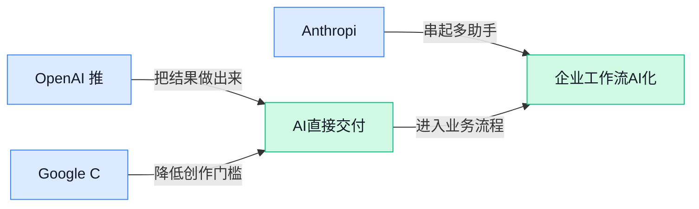

> AI 早报 · 每日早读 · 全网深度聚合

## **今日摘要**

```
OpenAI 连发 Workspace Agents 和 Responses API 长连接优化，ChatGPT 从对话工具直扑团队自动化平台
Google 发布第八代 TPU 双芯片、把 Agent 推上企业变现核心，正面硬刚英伟达 AI 基建
Anthropic Mythos（受限访问模型）遭未授权突破，Qwen3.6-27B 以270亿参数叫板旗舰级代码能力
```

### 🔵 产品与功能更新

1. **OpenAI 推出 workspace agents（工作区智能代理, 能在团队环境里自动执行一连串任务的 AI 助手），把 ChatGPT 从聊天工具推向团队自动化平台。**
这次更新的重点，是让 **ChatGPT** 不只是“会回答问题”，而是能在工作区里代你完成跨步骤任务，比如整理信息、调用工具、串联流程，明显更接近 **团队自动化** 的定位了 🚀。这里的 agent（智能代理, 指能根据目标自主拆解步骤并执行任务的 AI）对办公场景很关键，因为它意味着 AI 开始从“给建议”走向“直接干活”。如果后续接入更多企业系统，业务、运营、行政这类岗位也可能把重复流程逐步交给 AI 处理 💡。可查看 [完整发布报道(briefing)](https://the-decoder.com/openai-launches-workspace-agents-that-turn-chatgpt-from-a-chatbot-into-a-team-automation-platform/)


2. **Google Cloud 推出两款新 TPU（谷歌自研 AI 加速芯片, 专门用来训练和运行大模型）芯片，正面竞争英伟达。**
Google Cloud 在新一轮产品更新中发布了两款新的 **TPU**，并强调它们相比上一代更快、成本也更低 ⚙️。对企业客户来说，这类底层硬件升级会直接影响 **AI 训练** 和 inference（模型推理, 指训练好的模型实际回答问题或处理任务的过程）成本，最终会反映到云服务价格和可用性能上。值得注意的是，Google 一边强化自研芯片，一边仍继续在云平台支持英伟达，说明当下 **算力生态** 还远没到“二选一”的阶段。详情可见 [TechCrunch 报道(briefing)](https://techcrunch.com/2026/04/22/google-cloud-next-new-tpu-ai-chips-compete-with-nvidia/)


3. **Anthropic 的 Mythos（受限访问的 AI 模型）遭未授权用户突破，引发模型访问控制担忧。**
这条消息的核心不是新功能上线，而是 **受限模型** 的权限边界 apparently 被人绕过了，未授权用户成功接触到 Anthropic 的 **Mythos** 模型 🔐。这类事件提醒行业：模型能力越强，访问控制、身份验证和使用范围限制就越重要，否则“只开放给少数人”的设计很容易失守。对企业用户来说，这也意味着未来在采购或部署 AI 产品时，不能只看模型强不强，还得关注 **权限管理** 和安全隔离做得到不到位。更多信息见 [事件报道原文(briefing)](https://the-decoder.com/unauthorized-users-breach-anthropics-restricted-mythos-ai-model/)


### 🟢 前沿研究

1. **ClawNet（一种让多个用户的 AI 助手彼此协作的代理网络）探索“跨人协同”新方向。**
这篇研究关注的不是“一个人配一个 Agent”，而是让多个用户的 Agent 在得到人类配合下完成**跨用户协作** 🤝。标题里的 human-symbiotic（人与 AI 共生协作）可以理解为：AI 不是完全单干，而是在人类持续参与下分工配合；cross-user autonomous cooperation（跨用户自主协作）则是在不同人的任务之间自动衔接。对企业来说，这类方向如果成熟，未来很可能影响**跨部门流程自动化**，比如运营、销售、行政之间的信息传递不再靠手工来回转发。[论文页面介绍(briefing)](https://huggingface.co/papers/2604.19211)


2. **MM-JudgeBias（一套评估多模态大模型当“裁判”时偏见问题的基准）瞄准 AI 评分可靠性。**
这项工作研究的是 MLLM-as-a-Judge（让多模态大模型，也就是能同时看图文的模型，充当“评委”给结果打分）到底会不会有**组合性偏见** 🧪。所谓 benchmark（评测基准）就是一套标准化考题，用来系统测试模型在哪些情境下会偏心、误判或被表面信息带偏。它的意义很实际：越来越多公司会让 AI 帮忙做内容审核、回答质量评分、设计稿评审，如果“裁判模型”本身有偏差，后面整条业务链都会受影响。[论文基准页(briefing)](https://huggingface.co/papers/2604.18164)

3. **UDM-GRPO（一种面向离散扩散模型的稳定强化学习优化方法）想把训练过程变得更稳更省。**
这篇论文提出的 UDM-GRPO，核心是给 Uniform Discrete Diffusion Models（均匀离散扩散模型，一类按离散步骤逐步生成内容的模型）配上一种更稳定的优化方式 ⚙️。其中 GRPO（组相对策略优化）属于 reinforcement learning（强化学习，让模型通过反馈不断调整行为的训练方式）的一类思路，重点是减少训练波动、提升效率。对普通业务同事来说，这类底层研究虽然不直接变成产品，但它关系到未来生成模型是否能**更便宜、更稳定地训练和落地**。[论文说明页(briefing)](https://huggingface.co/papers/2604.18518)

4. **RDP LoRA（一种靠几何结构识别重要参数的低成本微调方案）继续压缩大模型改造成本。**
LoRA（低成本微调技术，只调整少量新增参数就能让大模型适应新任务）已经很流行，这篇 RDP LoRA 进一步研究怎样更聪明地找到“该改哪一部分” 📉。标题里的 geometry-driven identification（由几何结构驱动的识别）可以理解为：通过分析模型内部参数关系，挑出更关键的位置来做 adaptation（适配，让模型更贴合特定任务）。这对企业很重要，因为很多公司并不想从头训练模型，而是希望用更少算力、更低预算把现成大模型改造成自己的客服、知识库或办公助手。[论文介绍页(briefing)](https://huggingface.co/papers/2604.19321)

5. **TEMPO（一种把“边用边学”能力扩展到推理模型的训练方法）押注测试时训练。**
这项研究讨论的是 test-time training（测试时训练，模型在实际解题或使用过程中继续临时调整自己）如何用于 large reasoning models（大推理模型，擅长多步思考和复杂分析的大模型） 🧠。直白说，它想让模型不是“训练完就定型”，而是在遇到新题目时还能现场补一补状态，从而提升推理表现。若这类方向走通，未来 AI 在财务分析、报告总结、复杂问答等场景里，可能会更擅长处理**临场变化大、一步答不好的任务**。[论文页面(briefing)](https://huggingface.co/papers/2604.19295)

6. **HP-Edit（一套按人类偏好做后训练的图像编辑框架）想让修图结果更“懂人”。**
这篇论文聚焦 image editing（图像编辑）里的一个老问题：模型能改图，不代表改得符合人的审美和意图 🎨。它提出 human-preference post-training（基于人类偏好的后训练，在模型初步训练完成后，再用人的选择和反馈继续打磨）框架，目标是让编辑结果更贴近用户真正想要的效果。对设计、市场、电商团队来说，这类研究很关键，因为未来 AI 修图比的未必只是“能不能改”，而是**改出来是否更像一个懂需求的设计助理**。[论文详情页(briefing)](https://huggingface.co/papers/2604.19406)

7. **Chat2Workflow（一套评估“用自然语言生成可执行可视化流程”的基准）切中办公自动化痛点。**
这项工作关注的是：用户能不能直接用自然语言描述需求，让 AI 生成 executable visual workflows（可执行的可视化工作流，也就是能直接运行的流程图式自动化流程） 🪄。benchmark（评测基准）在这里的意义，是给“说一句话生成流程”这件事建立统一考核标准，看模型到底能不能真的落地，而不只是画个像样的图。对运营、人事、财务等团队尤其有想象空间，因为审批流、数据同步、通知分发这类重复工作，未来都可能从“手动搭流程”变成“直接说需求让 AI 生成”。[论文基准介绍(briefing)](https://huggingface.co/papers/2604.19667)

8. **ShadowPEFT（一种用“影子网络”提升低成本微调效果的方法）瞄准更省资源的大模型改造。**
PEFT（参数高效微调，用尽量少的新增参数完成模型适配）是企业部署大模型时很现实的路线，因为它能显著减少训练成本和显存压力 💡。这篇论文提出的 Shadow Network（影子网络，可以理解为一个辅助主模型学习的小网络）试图在不大幅增加资源消耗的情况下，提高 fine-tuning（微调，用特定数据继续训练，让模型更懂某个场景）效果。对想做私有化部署、行业定制模型的公司来说，这类研究的价值就在于：**同样预算下，能不能把模型调得更好用**。[论文页面介绍(briefing)](https://huggingface.co/papers/2604.19254)

### 🟡 行业展望与社会影响

1. **Google DeepMind 联手全球咨询公司，加速企业 AI 转型落地。**
Google DeepMind 表态要和多家**全球咨询机构**合作，把前沿 AI 更快带进各类组织的真实业务流程里 💼。这类合作的意义不只是“卖模型”，而是把战略、流程改造和技术实施一起打包推进，更接近很多公司真正关心的**怎么落地、谁来做、多久见效**。对业务、运营和管理岗位来说，这也说明企业级 AI 正从“试点项目”走向更大规模的组织升级，而不是只停留在聊天机器人层面。[官方合作说明(briefing)](https://deepmind.google/blog/partnering-with-industry-leaders-to-accelerate-ai-transformation/)


2. **SpaceX 押注 Cursor，折射 xAI 在编码能力上的补课压力。**
多家报道提到，SpaceX 正与 Cursor 合作，并拥有按 **600 亿美元**估值收购这家公司的选择权，这被外界解读为在帮 xAI 补足**代码生成**短板 🧩。报道还指出，Cursor 和 xAI 都没有能正面匹敌 Anthropic、OpenAI 头部产品的**自有模型**，因此这次联动既像资源整合，也暴露了各自能力缺口。对行业来说，这很值得关注：未来 AI 竞争不只是“谁模型更强”，还包括谁能拿下高频工作场景，比如程序员日常写代码、改代码、查问题的完整流程。[TechCrunch 报道(briefing)](https://techcrunch.com/2026/04/21/spacex-is-working-with-cursor-and-has-an-option-to-buy-the-startup-for-60-billion/) [解读文章原文(briefing)](https://the-decoder.com/musks-spacex-bets-60-billion-on-cursor-to-fix-xais-coding-gap/)


3. **Google 把 Agent（可自动执行多步任务的 AI 助手）推到企业变现核心位置。**
路透社消息显示，Google 正把 **Agent** 放到企业业务拓展的中心位置，不再只是强调模型能力，而是更看重它能不能真正替企业完成任务、创造收入 🚀。这里的重点在于，企业客户买单的逻辑正在变化：过去看“模型多聪明”，现在更看“能不能直接干活”，比如处理流程、协助决策、连接内部系统。对非技术同事来说，这意味着未来公司采购 AI 工具时，评估标准会越来越像招一位“数字员工”——不只是会回答问题，还得会做事。[路透相关报道(briefing)](https://news.google.com/rss/articles/CBMiqAFBVV95cUxNaC1SX002a0pCeURJUGFrcmxHQmNlM2k2dldpYVFzTDgxQjhlaWp4NmJja1FHNS1sdkt3SzFFcWxpVlJJekVQUFdsTFJob3lLb1h1Rk1XSXpDRGR0VXVZWDI3UUhWVnFBelV4SVNYSVRtNkVta3dIMFNucGZCMGdSaERNTkU3Rk5TeTlpT1FsQ29PaXdwRDlIU2ZtamVSNGZYOFU0ZDdlMUU?oc=5)

4. **OpenAI 用 WebSockets（让客户端与服务器保持实时长连接的通信方式）优化 Responses API（OpenAI 的模型调用接口），让 Agent 工作流更快。**
OpenAI 公开拆解了 Codex 的 Agent 循环，重点讲他们如何通过 **WebSockets** 和**连接级缓存**（在一次持续连接里复用上下文数据，减少重复传输）来降低接口开销、缩短响应延迟 ⚙️。这件事看似偏底层，但影响很现实：当 AI 要连续执行多步任务时，速度和稳定性会直接决定它能不能真正融入工作流，而不是每一步都卡顿等待。对行业而言，这说明下一阶段竞争不只看模型本身，还看整套**基础设施**是否足够顺滑，能不能支撑企业级的高频调用和长任务链路。[OpenAI 技术解析(briefing)](https://openai.com/index/speeding-up-agentic-workflows-with-websockets)

### 🟣 开源TOP项目

1. **android-reverse-engineering-skill（一个帮 Claude Code 做安卓应用逆向分析的技能库）走红。**
这个项目的定位很直接：给 Claude Code 补上一套 **Android 逆向工程**（把安装包拆开分析其结构、逻辑和资源文件，常用于安全研究与兼容性排查）能力，方便开发者或安全研究人员更系统地查看应用内部细节 🔍。它本质上是一个 **skill**（可理解为给 AI 编码助手加上的“专项工作手册”），不是单独的大模型，因此更像“教会助手按流程做事”。对普通业务团队来说，这类项目的意义在于：AI 正在从“会聊天”走向“会处理专业软件分析任务”，未来很多高门槛技术工作都可能被流程化拆解。[GitHub 项目页(briefing)](https://github.com/SimoneAvogadro/android-reverse-engineering-skill)


2. **android/skills（Android 官方整理的 AI 技能仓库）值得关注。**
这个仓库来自 Android 官方账号，名字虽然朴素，但重点在于它把一系列可复用的 **skills**（给 AI 助手使用的任务模板与操作规范）集中管理起来，方便开发者直接拿来扩展工作流 🧩。你可以把它理解成一套“给 AI 助手安排工种”的标准化资料，而不是单个应用。对企业来说，这类官方仓库释放出一个信号：未来很多软件开发、测试、排错流程，都会越来越依赖这种可复用的 AI 操作模板。[官方仓库页(briefing)](https://github.com/android/skills)


3. **taste-skill（一个让 AI 前端设计更有“审美”的技能包）主打告别千篇一律。**
这个项目想解决的是很多人都遇到过的问题：AI 虽然能很快生成页面，但做出来常常“能用不好看”，风格也容易很普通 😅。作者把它定义为 **High-Agency Frontend**（高自主性前端生成方式，指 AI 不只是机械照做，而是主动做出更完整的页面判断），核心目标就是让 AI 少产出模板味太重的界面。对设计、运营、产品同事来说，这类项目很有现实意义，因为它反映出 AI 生成内容正在从“有就行”进入“讲究质感和品牌感”的阶段。[GitHub 仓库(briefing)](https://github.com/Leonxlnx/taste-skill)


4. **agency-agents（一个把整家 AI 代理团队打包进仓库的项目）提供多角色协作思路。**
这个项目不是只放一个助手，而是打包了一整套 **agents**（可独立执行不同任务的 AI 助手角色），从前端、社区运营到创意增强、风险提醒都做了分工 🤖。它强调每个角色都有自己的流程、职责和可交付结果，思路很像把“一个人问 AI”升级成“一个虚拟团队协同干活”。对公司内部协作很有启发：未来不一定是每个岗位都单独配一个 AI，而可能是围绕一个项目同时拉起多个专职助手。[项目主页(briefing)](https://github.com/msitarzewski/agency-agents)

5. **ppt-master（一个把文档直接生成为可编辑 PPTX 的开源工具）很实用。**
这个项目瞄准的是办公场景里的高频痛点：把现成文档快速变成能汇报的演示文稿，而且生成的是原生 **PPTX**（PowerPoint 的演示文件格式，可直接继续修改），不是一张张不能编辑的图片 📊。摘要特别强调它输出的是可编辑的形状与版式，这意味着后续改标题、换图表、调样式会轻松很多。对行政、销售、运营、咨询类岗位来说，这类工具的价值非常直观：AI 不只是“帮你写”，而是开始真正接手成品文档制作。[GitHub 项目页(briefing)](https://github.com/hugohe3/ppt-master)

6. **FinceptTerminal（一个面向金融分析的现代化数据终端）把研究工具做成开源项目。**
这个项目聚焦金融场景，提供 **市场分析**、**投资研究** 和 **经济数据工具**，强调在友好界面里做交互式探索与数据驱动决策 📈。你可以把它理解为一个更现代化的金融信息工作台，适合围绕数据做观察、比对和研究。对财务、投研、战略团队来说，重点不只是“又一个工具”，而是越来越多专业分析能力正通过开源方式下沉，让中小团队也能接触到过去更偏机构化的研究体验。[GitHub 仓库页(briefing)](https://github.com/Fincept-Corporation/FinceptTerminal)

### 🔴 社媒分享

1. **Qwen3.6-27B（阿里通义千问新发布的 270 亿参数稠密模型）主打“小体量也能打旗舰级代码能力”。**
这次 Qwen 把重点放在**编程**和 **Agent** 能力上，强调这是一款 **open weight（开放权重，开发者可以下载模型参数自行部署）** 的 **dense model（稠密模型，每次回答都会动用整套参数，不是“分专家分工”的那类结构）** 💡。按官方说法，它想用相对更小的参数规模，去逼近旗舰级模型的代码与工具调用表现，这对想控制成本、又想保留较强能力的团队很有吸引力。对公司里的产品、运营和内部工具团队来说，这类模型的意义在于：未来做自动报表、流程助手、知识库问答，可能不必一上来就依赖最贵的云端模型。可先看 [Qwen 官方发布页(briefing)](https://qwen.ai/blog?id=qwen3.6-27b)，再结合 [Simon Willison 解读文章(briefing)](https://simonwillison.net/2026/Apr/22/qwen36-27b/#atom-everything) 了解外部观察 🚀


2. **ChatGPT 推出 Workspace Agents（工作区智能助手，可直接连到团队资料和办公系统）。**
OpenAI 这次瞄准的是企业真实办公场景：让 ChatGPT 不只是聊天，而是能在你的**工作区**里调用文件、资料和工具，完成更完整的任务链条 ✨。这里的 **workspace（工作区，指团队日常存放文档、知识和协作内容的空间）**，可以理解成“AI 不再只会回答问题，而是开始真正进入办公现场”；而 **Agent（能自己分步骤执行任务的 AI 助手）** 则意味着它会主动去找信息、整理结果、推进流程。对文职同事最直接的变化是，未来整理会议材料、汇总项目进度、从多个文档抽取重点，可能会从“人手复制粘贴”变成“AI 帮你跑完大半流程”。详情可看 [OpenAI 官方介绍(briefing)](https://openai.com/index/introducing-workspace-agents-in-chatgpt/)


3. **Google 发布第八代 TPU（谷歌自研 AI 加速芯片），为 Agent 时代准备两款新芯片。**
这次 Google 明确把新一代 **TPU（专门加速 AI 训练和推理的芯片）** 定位到 **agentic era（Agent 时代，AI 不只回答问题，还会连续执行复杂任务）**，并推出两种不同方向的产品。简单理解，一款更偏向大规模训练，一款更偏向实际运行与部署，也就是分别服务“把模型练出来”和“把模型高效跑起来”两类需求 🧠。这类基础设施升级虽然离普通员工稍远，但它会直接影响未来 AI 产品的**速度、成本和稳定性**：芯片越强，企业越可能把复杂 AI 功能真正做进日常业务系统里。可先看 [Google 官方博客(briefing)](https://blog.google/innovation-and-ai/infrastructure-and-cloud/google-cloud/eighth-generation-tpu-agentic-era/) 了解整体方向。

---



### 📊 行业洞察（今日 4 条）

1. OpenAI 发布 ChatGPT 的 workspace agents（工作区智能代理），可在团队环境中完成跨步骤任务。  
  【洞察】这表明大厂正把 AI 从问答工具推向执行平台，因为企业更愿为可交付结果付费；机会是切入办公流程，风险是权限边界与交付可靠性要求上升。

2. Google Cloud 推出第八代 TPU（谷歌自研 AI 加速芯片）两款新品，并继续同时支持英伟达生态。  
  【洞察】算力市场短期不会单一化，因为企业更重视成本、性能与兼容性的组合最优；机会是平台可做多模型适配，风险是底层差异加大产品整合难度。

3. Anthropic 的 Mythos（受限访问模型）被未授权用户接触，暴露模型访问控制问题。  
  【洞察】行业进入“能力越强，约束越关键”阶段，因为企业采购已不只看效果，也看权限管理与隔离；机会是安全治理成卖点，风险是信任成本显著抬高。

4. ClawNet 研究多用户 Agent（智能代理）跨人协作，Chat2Workflow 评测自然语言生成可执行流程。  
  【洞察】Agent 正从单人助手走向多人协同与流程生成，因为企业价值在跨部门衔接；机会是平台化编排，风险是复杂场景下责任划分与质量评估更难。

### 💭 对我们的启发（今日 3 条）

1. 结合 OpenAI workspace agents 与 Google 强推 Agent，可把产品重心放在多 Agent 协作与结果验收。机会是更贴近企业采购，风险是若只做入口层，易被大厂覆盖。

2. 参考 ClawNet 与 Chat2Workflow，我们应强化从自然语言到可执行流程的生成与迭代能力。机会是降低上手门槛，风险是复杂跨团队场景下错误传播会放大。

3. Anthropic Mythos 事件说明，A2A 平台必须把身份、权限与隔离做成核心能力。机会是建立差异化信任壁垒，风险是安全短板会直接拖累销售与合作推进。


---

> 本周周报：[第17周综合分析](https://ylzsdafei.github.io/ai-daily-site/blog/weekly/2026-w17/)
