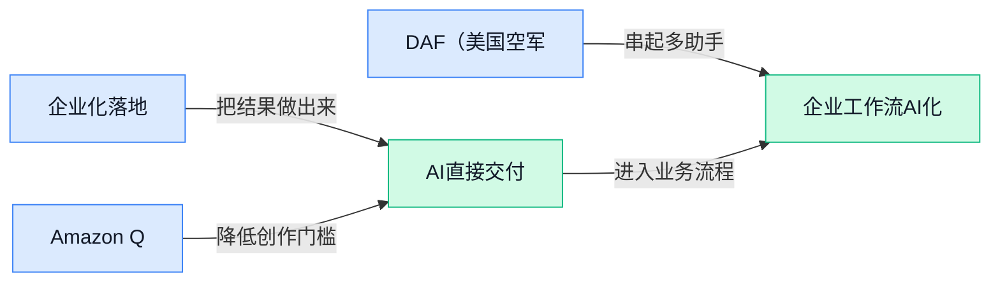

> AI 早报 · 每日早读 · 全网深度聚合

## **今日摘要**

```
OpenAI 模型与 Codex 杀入 Amazon Bedrock（亚马逊大模型平台），Managed Agents 同步登陆 AWS，企业 Agent 争夺战升级
Google 扩大五角大楼 AI 使用权限、与国防部合作照推不误，逾 600 名员工抗议仍未改结果
GitHub Copilot 改按 token 计费，Mistral AI 推出 Workflows，Amazon Quick（桌面 AI 助手）抢夺企业自动化入口
```

### 🔵 产品与功能更新

1. **OpenAI 模型、Codex 和 Managed Agents（托管式智能体服务，让企业把 AI 任务交给系统自动执行）登陆 AWS。**  
OpenAI 宣布把 **GPT 模型**、**Codex** 和 **Managed Agents（托管式智能体服务，让企业在托管环境里部署会自动完成任务的 AI）** 带到 **AWS（亚马逊云服务平台）**，重点面向企业客户在自家云环境里构建更安全的 AI 能力 ☁️。这意味着已经深度使用 AWS 的公司，不用大改基础设施，就能更方便接入 OpenAI 的能力做内部工具、业务流程自动化和开发辅助。对非技术团队来说，价值在于企业能更快把 AI 接进现有系统，同时更强调**安全**和**企业级部署**。详情可看 [OpenAI 官方发布页(briefing)](https://openai.com/index/openai-on-aws)

2. **Amazon Quick（一款可跨多个应用和数据源工作的桌面 AI 助手）发布，主打跨应用协作。**  
AWS 推出的 **Amazon Quick（桌面 AI 助手，能在不同软件、工具和数据之间帮用户完成任务）**，核心卖点是“跨应用可用” 🧩。从原文标题看，它不是只待在单一软件里的聊天框，而是希望打通你的**应用**、**工具**和**数据**，把桌面端的工作流串起来。对日常办公场景来说，这类产品如果落地顺畅，最直接的意义就是减少来回切窗口、复制粘贴和手动找资料的时间。更多信息见 [相关报道入口(briefing)](https://news.google.com/rss/articles/CBMiekFVX3lxTE1QblhzRVFrVHFfX0k0dVk4dFo4WWVIOFRuSDJUaDRtOXlzck4yZE45X0hndXZ6ZjAta0lmaktZcTFnVHJzdFpzenpvcHRWcFZCZ3d2NFV1cDg0T0tzaElXeDVFdGp4QjktNVhVTUliTUQtMTA1c2QzeDJ3?oc=5)

3. **DAF（美国空军部）启动 AI workforce（AI 人才队伍建设计划），补强组织用 AI 的能力。**  
这条更新的重点不是新模型或新软件，而是 **DAF（美国空军部）** 正式推出一项计划，准备加强 **AI workforce（能使用、管理和推进 AI 落地的人才队伍）** 建设 👥。它反映出一个很现实的趋势：很多组织眼下缺的不是“有没有 AI 工具”，而是“有没有人会把 AI 真正用进工作里”。对企业管理者来说，这也很有参考价值——未来竞争可能不只看采购了什么 AI 产品，还看团队是否具备相应的**技能体系**和**组织能力**。可查看 [新闻原始入口(briefing)](https://news.google.com/rss/articles/CBMipwFBVV95cUxQcmdqX2hzVzNZQ3FGMXVmNEs1ZEZ4c3dMYU1Yb193Tm90N21EZlZMY1hVdHdMck5KOWpQVG4xUnBadlNDTVFrX1QwTVNrU1ptUXAyLTBTblhXa21xV09FeHpMOVRNalBJR3RFVjhJS0VYVEVZWXBGUHZ1a1lLRkJ5RkxfVzA2UHQ4OGx5MG9hX3JWMzRWYmwwMkNlM2Q1LV9UV0ZOTkR2cw?oc=5)

### 🟢 前沿研究

1. **From Skills to Talent（把“技能型 Agent”组织成“公司团队”的研究）探索多智能体像真实公司一样协作。**
这篇论文把**异构 Agent**（能力各不相同的 AI 助手，不是一个模型分身成很多份）放进类似真实公司的组织结构里，重点不只是“谁会什么”，而是“谁该和谁配合” 🤝。它关注的是如何把零散的**技能**升级成可调度的**人才体系**，这对未来企业里多个 AI 助手协同做项目很关键。对业务同事来说，这类研究的意义在于：以后 AI 可能不只是一个聊天窗口，而会像一个有分工、有汇报关系的小团队那样完成复杂工作。可查看[论文摘要页(briefing)](https://huggingface.co/papers/2604.22446)了解原始内容。


2. **Iso-Depth Scaling Laws（等深度扩展规律）研究 Looped Language Models（可循环反复计算的语言模型）到底多“值”。**
这项工作讨论“多做一轮重复计算”究竟能换来多大性能提升，核心对象是**Looped Language Models**（让模型在相近结构里反复思考几轮，而不是单次一路算完的语言模型） 🔁。论文提出**Iso-Depth Scaling Laws**（在相同“思考深度”下比较模型规模与循环次数收益的规律），本质是在回答：增加参数和增加循环，哪个更划算。对公司来说，这关系到未来模型部署时的**成本—效果平衡**，也就是花同样资源，是买更大的模型，还是让模型多“想几遍”更合适。[论文摘要页(briefing)](https://huggingface.co/papers/2604.21106)

3. **ProEval（主动发现失败点的生成式 AI 评测方法）想把“哪里会翻车”提前找出来。**
很多生成式 AI 评测只看平均分，但真实使用里最麻烦的往往是少数高风险错误；这篇论文聚焦**Proactive Failure Discovery**（主动失败发现，先去找模型最容易出错的地方）和**Performance Estimation**（性能估计，用更省资源的方式判断整体表现） 🧪。换句话说，它不是只问“模型大概好不好”，而是更关心“它会在哪些场景突然不靠谱”。这对做客服、文案审核、知识库问答的团队很实用，因为上线前最想知道的往往不是平均表现，而是最危险的失误点。[论文摘要页(briefing)](https://huggingface.co/papers/2604.23099)

4. **Step-Level Advantage Selection（按步骤筛选训练信号的方法）试图让高效推理更稳定。**
这篇论文关注**高效推理**，也就是不靠特别长的思维链（模型一步步写很长“草稿”）也能把推理能力稳住 🧠。其中的**Advantage**（强化学习里用来判断“这一步比平均水平好多少”的信号）被细化到“每一步”去选择，希望减少训练过程里不稳定、忽好忽坏的问题。对非技术同事可以把它理解成：不是只看最后答案对不对，而是检查 AI 中间每一步是否真的在往正确方向走。原始论文可见[arxiv 论文页(briefing)](https://arxiv.org/abs/2604.24003)；也可参考[HuggingFace 论文页(briefing)](https://huggingface.co/papers/2604.24003)。

5. **研究称 AI 文本正让互联网内容变得更统一，也“诡异地更开心”。**
这篇报道总结了一项观察：随着越来越多网页内容由 AI 生成，互联网语言风格开始变得更像、语气也更偏**积极乐观** 😊。所谓“更统一”，指的是措辞、句式和表达习惯越来越接近；所谓“更开心”，则是文本整体情绪更偏正向，哪怕讨论的是本来中性的内容。对企业内容团队来说，这提醒大家：AI 写作虽然提效，但如果所有文案都用同一种模板味道，品牌个性和真实感可能会被慢慢磨平。[完整报道(briefing)](https://the-decoder.com/researchers-find-ai-text-is-making-the-internet-more-uniform-and-weirdly-cheerful/)

6. **Process-Level Reward Modeling（按过程打分的奖励模型）瞄准 Agentic Data Analysis（AI 自主做数据分析）。**
这篇论文强调，评价 AI 做数据分析时，不该只看最终结论，还要奖励它中间是否走了合理的**科学过程** 📊。其中的**Reward Modeling**（奖励建模，给模型“什么算做好”的评分机制）从结果层面下沉到过程层面，适合用于**Agentic Data Analysis**（让 AI 像分析师一样主动提出步骤、处理数据、形成结论）。这类思路的重要性在于：当 AI 开始独立做分析报告、实验总结、业务洞察时，过程是否严谨会直接影响可信度，而不只是“最后看起来像不像那么回事”。[论文摘要页(briefing)](https://huggingface.co/papers/2604.24198)

7. **Stochastic KV Routing（随机键值路由机制）研究怎样更灵活共享模型缓存。**
这篇论文围绕**KV Cache**（键值缓存，模型在生成长文本时暂存上下文信息的记忆区）展开，目标是让不同深度层级之间更自适应地共享这些缓存，从而提升效率 ⚙️。其中 **Depth-Wise Cache Sharing**（按模型层深度共享缓存）可以理解为：不是每一层都各管各的记忆，而是更聪明地决定哪些信息该复用。对实际应用来说，这类优化会影响长对话、长文档处理和复杂推理时的速度与显存占用，也就是“同样硬件能不能跑得更快更省”。[论文摘要页(briefing)](https://huggingface.co/papers/2604.22782)

### 🟡 行业展望与社会影响

1. **Google 扩大五角大楼对其 AI 的使用权限，军用边界之争再起。**
这条消息的核心，不只是 **Google** 签了新合同，更是它接住了 **Anthropic** 明确拒绝的一类需求：美国国防部将不能使用 Anthropic 的 AI 做**国内大规模监控**和**自主武器**，但 Google 选择继续合作 ⚠️。这让 AI 行业里一个越来越现实的问题浮出水面：同样是大模型公司，面对政府与军方客户，**价值观边界**和**商业边界**并不一致。对普通企业同事来说，这件事意味着未来我们讨论 AI，不只是在聊效率工具，更是在聊谁来决定 AI 能被用到什么地方、不能被用到什么地方。[TechCrunch 报道(briefing)](https://techcrunch.com/2026/04/28/google-expands-pentagons-access-to-its-ai-after-anthropics-refusal/) [相关报道汇总(briefing)](https://news.google.com/rss/articles/CBMijgFBVV95cUxPeXRJam8yYUVDUUJSWW1KdkVuMHRKUGM1NnJYY1FGT2xPY1hoUEU1dVpUTmVSWTBpcml6YjlVd1NNaHVzOG1TemplNk1vT001eGRuSTk2aUlzUXBOcUJXTl9PMFVucHl2OEttNTEza3B3U3VwenpoYWE0NjBUWWVmV0w5d2FxYS02RS1jU0RR?oc=5)


2. **Google 与五角大楼签 AI 合作，逾 600 名员工抗议未能改变结果。**
除了外部争议，这笔合作也暴露了 AI 公司内部的**治理张力**：即便有超过 600 名员工反对，Google 仍推进了与五角大楼的协议 😶。这说明在大型科技公司里，员工对 AI 用途的伦理担忧，未必能真正改变高层的战略决策；所谓伦理承诺，最终还是要看合同怎么签、资源怎么投。对行业观察者来说，这不是一条单纯的商业新闻，而是一个信号：未来 AI 企业的竞争，可能会同时比拼**技术能力**、**政府关系**和**内部共识管理**。[完整报道(briefing)](https://the-decoder.com/google-signs-ai-deal-with-the-pentagon-ignoring-protest-from-over-600-employees/)


3. **GitHub Copilot 改按 token（模型处理文字的计量单位，像“按字数+计算量”收费）计费，AI 成本开始更精细化。**
GitHub Copilot 将从 2026 年 6 月起转向 **token-based billing（按 token 计费）**，这意味着 AI 编码助手的成本不再只是“包月随便用”，而会更贴近真实消耗 💰。**token（模型处理文字的最小计量单位）** 可以粗略理解为 AI 每次读写内容时消耗的“算力小筹码”，用得越多，成本越高。对企业来说，这类变化会直接影响预算、采购和使用规范：以后不只是“要不要上 AI”，还要开始算“哪些团队最值得用、怎么用最省钱”。[计费调整报道(briefing)](https://the-decoder.com/github-copilot-switches-to-token-based-billing-in-june-2026/)

4. **Ask YouTube（YouTube 的对话式视频搜索功能）把搜视频变成“边聊边找”。**
Google 推出的 **Ask YouTube（YouTube 的对话式视频搜索功能）**，本质上是把原来的关键词搜索，升级成可以直接提问、追问的交互方式 🎥。这类变化看似只是产品小更新，实际代表内容平台正在从“你自己找答案”转向“AI 先帮你理解内容、再给你答案”。对做运营、培训、知识管理的同事尤其有启发：未来视频不只是播放媒介，还可能变成可被 AI 即时检索、总结和问答的“知识库”。[功能报道(briefing)](https://the-decoder.com/googles-ask-youtube-turns-video-search-into-a-conversation/)

5. **Mistral AI 推出 Workflows（让企业把多个 AI 步骤串成自动流程的功能），瞄准企业级协作自动化。**
Mistral AI 正在用 **Workflows（把多个 AI 步骤连接起来自动执行的流程编排功能）** 切入企业市场，这不是单纯再发一个聊天机器人，而是想让企业把 AI 真正塞进日常工作流里 🚀。所谓 **orchestration（编排，像项目经理一样安排多个步骤和工具协同工作）**，可以理解为让 AI 自动完成“接收任务、调用工具、处理信息、输出结果”这一整套链路。对公司管理层和中后台团队来说，这类产品的意义在于：AI 的竞争焦点正在从“谁回答得更聪明”，转向“谁能更稳定地接入业务流程、真的替团队省时间”。[产品报道(briefing)](https://the-decoder.com/mistral-ai-takes-on-enterprise-ai-orchestration-with-workflows/)

### 🟣 开源TOP项目

1. **OpenMetadata（统一元数据管理平台）帮团队把数据资产“看清、管住、协同起来”。**
这个项目主打 **数据发现**、**数据可观测性**（持续监控数据是否异常、是否可靠）和 **数据治理**（给企业数据定规则、管权限、保质量）三件事放到一个平台里做，很适合数据表越来越多、跨团队协作越来越复杂的组织。它依托 **中央元数据仓库**（专门存“数据的说明书”，比如这张表是谁建的、字段是什么意思）和 **列级血缘**（精确追踪每一列数据从哪里来、经过哪些加工）来提升透明度 💡。对业务、运营、财务同事来说，这类工具的价值在于：以后找数据、问口径、追来源，不必总靠“问人”。可从 [GitHub 项目页(briefing)](https://github.com/open-metadata/OpenMetadata) 了解更多。


2. **Symphony（OpenAI 开源的自动化项目执行框架）想把“盯着 AI 写代码”变成“直接管任务”。**
它的核心思路是把项目工作拆成一个个 **隔离运行**（每次任务在独立环境中执行，避免互相干扰）的自动执行单元，让团队不用时时监督编码过程，而是专注分配任务和验收结果。摘要里提到它支持 **autonomous implementation runs**（自主实现流程，也就是 AI 按要求自己完成一轮开发执行），这对需要并行推进多个开发任务的团队尤其有吸引力 🚀。通俗说，就是把“人盯着 Agent 一步步干活”变成“人负责派单，系统负责落地”。项目见 [官方仓库(briefing)](https://github.com/openai/symphony)。


3. **awesome-codex-skills（Codex 实用技能清单）把自动化工作流玩法集中整理好了。**
这是一个面向 **Codex CLI**（命令行工具，用打字命令的方式调用 Codex）和 **API**（让别的软件也能接入 Codex 的接口）的实用技能合集，重点是整理可直接上手的自动化场景。它的价值不在“发明新模型”，而在于把零散经验变成可复用清单，帮团队更快找到“Codex 能替我做什么” 🧩。对非技术同事也有启发：很多日常重复流程，未来都可能被标准化成一套可复制的 AI 操作模板。可查看 [技能仓库列表(briefing)](https://github.com/ComposioHQ/awesome-codex-skills)。


4. **awesome-gpt-image-2（GPT Image 2 提示词大库）把图像生成经验做成了可直接参考的“案例仓库”。**
这个项目主打 **2000+ 精选提示词**，还配有预览图，并支持 **16 种语言**，相当于把大量“怎么写提示词更出图”经验系统化整理出来。摘要特别强调 GPT Image 2 在 **文字渲染**（让图片里的文字更准确清晰）、**跨图一致性**（同一角色或元素在多张图里保持统一）和 **商业级插画** 方面的能力，这对设计、市场、内容团队都很实用 🎨。如果你关心“AI 出图怎么更稳定、更像成品”，这类项目比单纯看模型宣传更接地气。详情可见 [提示词资源库(briefing)](https://github.com/YouMind-OpenLab/awesome-gpt-image-2)。

5. **LLM Wiki（把文档自动整理成知识库的桌面应用）想替代“每次都重新查资料”的低效流程。**
它是一款 **跨平台桌面应用**，能把文档逐步整理成有结构、彼此互相关联的知识库，而不是像传统 **RAG（检索增强生成，让 AI 每次回答前临时去资料库里查一遍）** 那样每次都“现查现答”。摘要提到它会 **增量构建和维护** 知识库，也就是新资料进来后持续补充，不必每次从头组织内容 🧠。对文档多、知识分散的团队来说，这意味着内部资料可能从“堆文件”升级成“能被持续整理和关联的知识网络”。项目地址见 [桌面知识库项目(briefing)](https://github.com/nashsu/llm_wiki)。

6. **awesome-gpt-image-2（工业级 GPT-Image2 提示词引擎）把“提示词”做成了更像模板系统的生产工具。**
这个版本强调 **Prompt as Code**（把提示词像代码一样模块化、可复用、可管理），并提供 **329 个逆向案例** 和 **13 套工业级模板**。和普通“灵感型提示词收藏”不同，它更偏向把出图经验沉淀成标准化资产，适合需要批量、稳定产出视觉内容的团队 ⚙️。对运营、电商、品牌设计来说，这类模板库的意义在于：AI 出图不再只靠个人手感，而是更接近可复制的工作流。可访问 [工业级模板仓库(briefing)](https://github.com/freestylefly/awesome-gpt-image-2)。

### 🔴 社媒分享

1. **OpenAI 模型将接入 Amazon Bedrock（亚马逊云上的大模型托管平台），AWS 还想把托管 Agent 做成企业标配。**
这条消息的核心，不只是 **OpenAI** 和 **AWS** 同台，更是 OpenAI 模型要进入 **Amazon Bedrock（亚马逊提供的大模型调用与管理平台，企业不用自己搭底层就能接入多家模型）**。对公司用户来说，这意味着以后在 AWS 体系里选模型、配权限、做合规会更顺手，采购和落地流程也可能更统一 💡。采访里还谈到 **Managed Agents（托管式 Agent，企业只设目标和规则，平台负责运行、调度和维护）**，说明云厂商正在把“会聊天的 AI”往“能直接干活的 AI”推进。想看原始表述可以读 [高管专访全文(briefing)](https://stratechery.com/2026/an-interview-with-openai-ceo-sam-altman-and-aws-ceo-matt-garman-about-bedrock-managed-agents/) 和 [AWS 官方发布页(briefing)](https://aws.amazon.com/bedrock/openai/) 🚀


2. **NVIDIA Nemotron 3 Nano Omni（英伟达推出的多模态小型模型）瞄准长上下文文档、音频和视频 Agent。**
英伟达这次发布的 **Nemotron 3 Nano Omni（能同时理解文档、音频、视频的小型多模态模型）**，重点是 **Long-Context（长上下文，指一次能处理很长材料，比如长文档、整段会议录音或长视频）** 能力，适合做更“耐读耐看”的 Agent。对普通业务团队来说，这类模型的价值在于：它不只是看一张图、听一句话，而是能围绕一整份资料持续理解和执行任务 📄🎧🎬。如果后续被集成进客服、知识库、内容审核等流程，就可能减少“材料太长、AI 看不完”的老问题。[HuggingFace 官方介绍(briefing)](https://huggingface.co/blog/nvidia/nemotron-3-nano-omni-multimodal-intelligence)

3. **TRELLIS.2（微软提出的开源图片转 3D 模型）把高保真 3D 资产生成又往前推了一步。**
据分享内容，**TRELLIS.2（把 2D 图片直接生成 3D 资产的开源模型）** 是一个 **4B 参数（约 40 亿参数，参数量越大通常代表模型表达能力越强）** 的图像转 3D 系统，主打更高精度的生成效果。它能输出带 **PBR 纹理（基于物理规则的材质效果，让 3D 物体看起来更像真实世界）** 的 3D 资产，这对电商展示、游戏素材、工业设计预览都很有吸引力 ✨。原文还提到它基于原生 3D **VAE（变分自编码器，一类把复杂数据压缩再还原的模型，像先打包再展开）**，目标是兼顾效率、可扩展性和细节质量。[社区整理帖(briefing)](https://www.reddit.com/r/LocalLLaMA/comments/1sxf2u0/microsoft_presents_trellis2_an_opensource/)

---



### 📊 行业洞察（今日 4 条）

1. OpenAI把GPT、Codex、Managed Agents（托管式智能体服务）接入AWS与Amazon Bedrock（大模型托管平台）。
  【洞察】企业AI正从“买模型”转向“买落地环境”，因为云内接入更符合安全与采购流程，但也会加深平台绑定风险。

2. Amazon Quick（跨应用桌面AI助手）发布，强调可连接多种应用、工具与数据源完成任务。
  【洞察】桌面入口正成为Agent新战场，因为跨应用协作比单点问答更接近真实办公价值，但权限复杂也会拖慢采用。

3. Mistral AI推出Workflows（多步骤AI流程编排功能），明确瞄准企业级协作自动化场景。
  【洞察】行业竞争焦点已转向流程编排层，因为企业更关心结果稳定与系统接入，不过同质化也会压缩功能溢价。

4. Google在Anthropic拒绝相关需求后，仍扩大五角大楼对其AI的使用权限并推进合作。
  【洞察】大模型商业化正进入边界分化期，因为政府订单价值高但伦理争议大，未来品牌、合规与组织治理都会受考验。

### 💭 对我们的启发（今日 3 条）

1. 参考OpenAI上AWS与Bedrock，A2A平台应先做多模型接入与权限分层，机会是更易进企业，风险是过度依赖单一云生态。

2. 参考Mistral Workflows与Amazon Quick，我们可把重点放在跨工具协同与结果验收，机会是贴近业务，风险是功能易被大厂快速覆盖。

3. 参考Google军方合作与DAF人才建设，平台不只卖功能，还要卖治理与培训；机会是提升客单价，风险是销售周期被明显拉长。


---

> 本周周报：[第18周综合分析](https://ylzsdafei.github.io/ai-daily-site/blog/weekly/2026-w18/)
