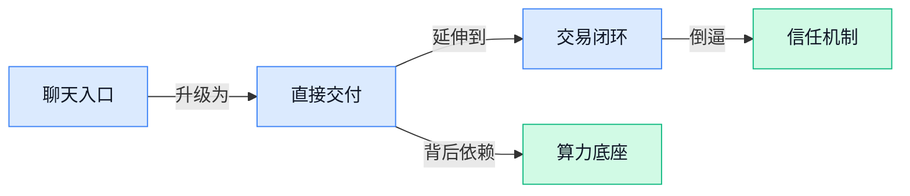

> AI 早报 · 每日早读 · 全网深度聚合

## **今日摘要**

```
OpenAI 落地 AWS、扩建 Stargate（超大规模数据中心计划），微软独家算力松动，AI 基建格局生变
Google 连发 Gemini 记忆、文档表格演示稿、电视 AI 功能，还可能塞进广告，直扑 ChatGPT 腹地
Stripe 联手 Google 把 AI 购物塞进 Gemini 和 AI Mode（AI 搜索模式），Google Photos 又用 AI 做智能衣橱
```

### 🔵 产品与功能更新

1. **Google TV 将迎来更多 Gemini 功能，电视也能玩转 AI 照片和视频。**
Google 给 **Google TV** 继续加料，这次重点是把 **Gemini** 的能力往大屏体验里再推进一步 📺。根据报道，新功能包括用 **Nano Banana（Google 的图像处理工具，用来改造和重绘照片）** 和 **Veo（Google 的 AI 视频生成工具，可把想法变成视频片段）** 来变换照片和视频，让电视不只是“看内容”，也开始“做内容”了。对普通用户来说，这意味着家庭屏幕可能逐步变成一个更直接的 **AI 创作入口**；对内容平台和硬件厂商来说，大屏交互的想象空间也在变大。[完整报道(briefing)](https://techcrunch.com/2026/04/29/more-gemini-features-are-coming-to-google-tv/)


2. **Stripe 联手 Google，把 AI 购物能力带进 Gemini 和 AI Mode（Google 的 AI 搜索模式）。**
这次合作的核心，是让 **Stripe（全球主流在线支付平台）** 的支付与交易能力接入 **Gemini** 和 **AI Mode（Google 在搜索中提供的 AI 对话式结果页）**，把“问商品—挑商品—下单”串成更完整的一条线 🛒。简单说，AI 不只是帮你找信息，而是更进一步参与 **购物决策** 和 **交易流程**。这对电商、支付、广告投放团队都很值得关注：如果用户越来越习惯在 AI 对话里完成购买，未来的流量入口和转化路径可能都会改写。[相关报道(briefing)](https://news.google.com/rss/articles/CBMiakFVX3lxTE12VGEyU3dYMmlqVHFfTy1FZE0wVHhrdjVZRHBfenE4SUY3X0IzTk01cDk2S1pfLUtENjU2Z290U2hUb3BjUzZ5U0pRd3FvNVczOFRfc3NSSlM5bEdwOXd4d1FfUzlyRGVmRVE?oc=5)


3. **Google Photos 用 AI 做出《独领风骚》同款智能衣橱。**
Google Photos 新功能会利用 **AI**，根据你照片库里出现过的衣服，自动生成一份你的“数字衣橱” 👗。换句话说，它会从 **Google Photos** 里识别穿搭单品，帮你整理出自己都有哪些衣服，颇像把照片相册变成一个轻量版穿搭管理器。对用户来说，这类功能把“存照片”延伸成了“管生活”；对零售、时尚和内容平台来说，也能看出 AI 正在把图像识别能力推向更具体的日常场景。[完整报道(briefing)](https://techcrunch.com/2026/04/29/google-photos-uses-ai-to-make-the-iconic-closet-from-clueless-a-reality/)

### 🟢 前沿研究

1. **OpenAI 研究员解释：数学为何是通向 AGI（通用人工智能，指像人一样能广泛解决问题的 AI）的必经之路。**
这篇解读把一个很“硬核”的判断讲明白了：如果 AI 想真正具备**通用推理**能力，光会模仿语言还不够，必须在**数学**这种高约束、可验证的任务里练出真本事 🧠。数学之所以关键，是因为答案对错更清晰，能逼着模型学会一步步推导，而不是只靠“看起来像对”的表达。对行业来说，这也解释了为什么越来越多公司把**推理能力**、**可验证训练**（能通过明确标准检查模型是否答对）当成下一阶段重点。[完整报道(briefing)](https://the-decoder.com/openai-researchers-explain-why-math-is-the-road-to-agi/)


2. **Nemotron 3 Nano Omni（英伟达推出的多模态模型，可同时处理文字、图片、视频和音频）展示现代多模态模型到底怎么做出来。**
英伟达这次不只是发模型，更像是把一套现代**多模态**（让 AI 同时理解多种信息形式）研发思路摊开给行业看 👀。Nemotron 3 Nano Omni 原生支持**音频输入**，说明现在的模型设计已经从“单一文本大脑”走向“统一感官系统”。对普通业务团队也有现实意义：未来的 AI 助手不只是能读文档，还可能直接听会议、看图片、理解视频内容，应用边界会更宽。[报道解读(briefing)](https://the-decoder.com/with-nemotron-3-nano-omni-nvidia-reveals-what-really-goes-into-a-modern-multimodal-model/) [arxiv 论文(briefing)](https://arxiv.org/abs/2604.24954)


3. **Architecture Determines Observability in Transformers（研究 Transformer 架构如何影响“看懂模型内部状态”的论文）指出：模型能不能被监控，很多时候是结构先决定的。**
这篇论文讨论了一个很实际的问题：AI 明明会**自信地答错**，那我们能不能从它内部信号里提前发现风险 ⚠️。作者认为，激活监控（观察模型内部数值变化，像给 AI 做“体征监测”）是否有效，关键取决于 **Transformer**（当前大模型最常见的神经网络结构）有没有保留足够的内部线索，而不只是看表面的输出置信度。对企业使用 AI 来说，这提醒大家：想做更可靠的风控、审核或高风险问答，不能只盯结果，还要关注模型架构是否适合被“观察”。[arxiv 论文(briefing)](https://arxiv.org/abs/2604.24801)

4. **ClawGym（一个用于训练 Claw Agent〈抓取类智能体〉的可扩展框架）瞄准更有效地构建操作型 AI。**
这项工作聚焦 **Claw Agent**（能执行抓取、操作等动作的智能体），核心是提供一个更易扩展的训练框架，让这类系统更高效地被构建和评估 🤖。相比只会聊天的模型，操作型 Agent 更接近“能动手干活”的 AI，未来可能进入机器人、自动化仓储和工业场景。对前沿研究来说，这类框架的重要性在于它能降低实验成本，让研究者更系统地比较不同训练方法。[论文页面(briefing)](https://huggingface.co/papers/2604.26904)

5. **System-Integrated Speculative Decoding（系统级集成推测解码，用较快草稿结果加速正式生成）可提升强化学习后训练的 rollout（让模型反复试答、收集表现数据）速度。**
这篇研究瞄准的是大模型训练里很“烧时间”的一段：**RL post-training**（强化学习后训练，模型在基础训练后继续通过反馈优化行为）所需的大量 rollout。作者提出把 **speculative decoding**（先用更快的草稿生成，再由正式模型确认，从而提速）直接和系统层整合，目标是让训练阶段的数据采样跑得更快 🚀。这类优化虽然看起来偏底层，但意义很直接：训练效率上去，模型迭代速度和成本控制就更有空间。[论文页面(briefing)](https://huggingface.co/papers/2604.26779)

6. **Unified 4D World Action Modeling（统一四维世界动作建模，把时间变化也纳入世界理解）探索从视频先验中学习行动能力。**
这项研究想解决的不是“看懂一帧画面”，而是让 AI 从视频中学会一个持续变化的**世界模型**（让机器在脑中模拟环境如何变化）🌍。论文提到 **asynchronous denoising**（异步去噪，让模型分阶段还原复杂信息而不是一次性生成），以及利用视频先验来做统一的动作建模。简单说，它是在推动 AI 从“会描述画面”走向“能理解事件如何演变、动作会带来什么后果”，这对机器人、自动驾驶和交互式虚拟环境都很关键。[论文页面(briefing)](https://huggingface.co/papers/2604.26694)

### 🟡 行业展望与社会影响

1. **OpenAI 落地 AWS，微软重组合作后算力格局再生变。**
OpenAI 在与微软调整合作结构后，仅隔一天就宣布使用 **AWS**（Amazon Web Services，亚马逊云计算平台）提供新的算力支持，这说明顶级大模型公司不再把鸡蛋放在一个篮子里 ☁️。对行业来说，**算力**（训练和运行 AI 的核心计算资源）正在从“绑定单一巨头”走向“多云分配”，背后是对稳定性、扩容速度和议价能力的综合考量。对企业用户和采购部门也有启发：未来 AI 服务的成本、速度和可用性，越来越取决于底层云资源怎么布局，而不只是模型本身有多聪明。[完整报道(briefing)](https://the-decoder.com/openai-lands-on-aws-one-day-after-microsoft-deal-restructuring/)


2. **OpenAI 扩建 Stargate（OpenAI 推进的超大规模 AI 数据中心计划），为“智能时代”提前铺路。**
OpenAI 表示正在扩大 **Stargate**（超大规模 AI 基础设施项目）的数据中心容量，以满足持续增长的 AI 需求 🏗️。这里的关键不是“又建了机房”，而是 **数据中心容量** 直接决定了模型训练、上线响应速度以及新产品发布节奏。对普通公司同事来说，可以把它理解成：未来谁能更快建好“AI 发电厂”，谁就更有机会主导下一轮产品创新和服务供给。[OpenAI 官方说明(briefing)](https://openai.com/index/building-the-compute-infrastructure-for-the-intelligence-age)

3. **Karpathy 提醒：Vibe Coding（凭感觉让 AI 帮你写代码）只是前菜，Agentic Engineering（以 AI 代理协作方式做软件工程）才是重点。**
Karpathy 认为，AI 编程的下一步不只是“写得更快”，而是进入 **Agentic Engineering**（让多个 AI 代理分工协作、并对结果负责的软件开发方式）阶段 🤖。他说得很直白：如果只追求生成速度，却守不住 **软件质量**，那最终只是把问题更快地制造出来。这个判断对非技术岗位也很重要，因为未来很多业务系统、内部工具和自动化流程会更快上线，但企业真正需要的是“可维护、可追责、能稳定运行”的 AI 参与式开发。[访谈解读全文(briefing)](https://baoyu.io/blog/andrej-karpathy-from-vibe-coding-to-agentic-engineering)


4. **OpenAI 发布“智能时代”网络安全方案，想把 AI 防御能力更广泛地铺开。**
OpenAI 提出一套五部分行动计划，核心是推动 **AI 驱动的网络防御**，并保护关键系统安全 🔐。这里的重点不只是“防黑客”，而是让更多组织能用上更强的安全工具，提升对重要基础设施和核心业务系统的保护能力。对企业管理者来说，这释放出一个明确信号：AI 不仅会带来效率红利，也会放大安全攻防压力，未来 **网络安全** 很可能从 IT 部门议题，变成经营层必须持续关注的事项。[官方行动计划(briefing)](https://openai.com/index/cybersecurity-in-the-intelligence-age)

5. **Google 释放强烈信号：Gemini 里可能要加入广告。**
报道指出，Google 给出了迄今最明确的暗示，**Gemini** 的商业化可能会进一步走向广告模式 💰。这件事的意义不小，因为一旦聊天式 AI 加入广告，用户体验、内容排序和品牌投放逻辑都可能被改写。对市场、运营和品牌团队来说，这意味着未来的流量入口不只在搜索结果页，也可能逐步转移到“AI 对话框”里，新的投放规则值得提前关注。[完整报道(briefing)](https://news.google.com/rss/articles/CBMieEFVX3lxTE9UYXNYdU9tUmVzSTJleThDY3JvUWZCQ1hSbkRfSGhxZWZqYzJwa3g3Y0s1aGhlLXU5bnB2X3V1TEVBMHRhSm92Z2dUay1ZbXU0b0ZYRkNIeG1JN3ByN1VSdEtEbDRiY3dnSUtHWWJmbVVOSHZ1LWZkTw?oc=5)

6. **Gemini 可在聊天中直接生成文档、表格和演示稿，AI 办公入口继续前移。**
Google 正让 Gemini 直接在对话里生成完整的 **文档、电子表格和演示文稿**，等于把“问 AI”和“做成正式产出”这两步连在一起了 📝。这会进一步压缩用户在聊天工具与办公软件之间来回切换的时间，也让 AI 更像一个真正能交付结果的办公助手。对行政、运营、销售支持和人事等岗位来说，这类能力如果成熟，最直接的变化就是日常材料产出会更快，初稿门槛也会明显下降。[功能报道(briefing)](https://the-decoder.com/google-gemini-now-generates-full-documents-spreadsheets-and-presentations-directly-inside-the-chat/)

7. **Google 在欧洲上线 Gemini 记忆功能，还想把 ChatGPT 用户数据迁过来。**
Google 开始在欧洲推出 Gemini 的 **记忆功能**，并希望用户把自己在 ChatGPT 里的相关数据一并带过来，这明显是在争夺长期使用习惯和用户留存 🧠。所谓记忆功能，就是 AI 能记住你的偏好、背景和常用需求，从而给出更贴身的回答；一旦再支持数据迁移，切换平台的门槛就会更低。对行业而言，这说明 AI 竞争正在从“谁更会答题”升级到“谁更懂你、谁更难被替代”的阶段。[完整报道(briefing)](https://the-decoder.com/google-rolls-out-gemini-memory-in-europe-and-wants-you-to-bring-your-chatgpt-data-along/)

### 🟣 开源TOP项目

1. **VibeVoice（微软开源的语音 AI 项目）瞄准前沿语音能力。**
这个项目的官方简介只有一句话：它是 **Open-Source Frontier Voice AI**，也就是微软开源的一套更前沿的**语音 AI**能力 🚀。对普通团队来说，这类项目最值得关注的点在于：未来做客服语音、语音助手、会议转语音交互时，可能有更多可直接上手的开源底座。这里的 open-source（开源，代码公开可下载修改）意味着企业和开发者能更灵活地试用、定制和接入。[GitHub 项目页(briefing)](https://github.com/microsoft/VibeVoice)


2. **Symphony（OpenAI 开源的任务隔离式 Agent 工具）想把“盯着 AI 写代码”变成“管理项目进度”。**
按照项目说明，Symphony 会把项目工作拆成一个个 **isolated runs**（隔离运行环境，像把不同任务放进独立工位，互不打扰）和 **autonomous implementation runs**（自动执行的实现流程），让团队少盯过程、多管结果 💡。这背后的意思很直白：不是让人一直监督 coding agents（代码 Agent，能自动写代码和执行步骤的 AI 助手），而是把重点转到任务分配与验收上。对管理者和跨部门协作来说，这种思路更接近“派单 + 看交付”，而不是“围观 AI 一步步干活”。[GitHub 仓库说明(briefing)](https://github.com/openai/symphony)


3. **caveman（用“原始人式表达”帮 Claude Code 省 token 的技能包）主打低成本高输出。**
这个项目的核心卖点非常直接：通过一种更短、更压缩的沟通方式，帮 Claude Code 减少 **65% tokens**。这里的 token（模型处理文字时切分出的最小文本单位，可以粗略理解为 AI 的“计费字数”）越少，通常就越省钱、越快 ⚡。它本质上是一个 Claude Code skill（给 Claude Code 添加固定工作习惯和行为规则的技能配置），适合想压缩 AI 编码成本的团队参考。[项目主页介绍(briefing)](https://github.com/JuliusBrussee/caveman)


4. **andrej-karpathy-skills（基于 Karpathy 观察整理的 Claude Code 提示文件）试图减少大模型写代码翻车。**
这个仓库提供的是一个单独的 **CLAUDE.md** 文件，可以直接拿来改进 Claude Code 的行为表现。它的来源是 Andrej Karpathy 对 **LLM**（大语言模型，也就是 ChatGPT、Claude 这类会理解和生成文字的模型）编码常见坑点的观察总结，所以重点不是“新模型”，而是“更会用模型” 🧠。对日常需要 AI 协助写脚本、改文档工具或处理重复开发任务的人来说，这类提示文件往往能明显减少跑偏和返工。[GitHub 项目页(briefing)](https://github.com/forrestchang/andrej-karpathy-skills)

5. **graphify（把代码和文档变成可查询知识图谱的 AI 编码助手技能）适合做团队知识整理。**
它支持 Claude Code、Codex、Cursor、Gemini CLI（命令行界面的 Gemini 工具，可在电脑终端里直接调用 AI）等多种 AI 编码助手，把任意文件夹里的代码、文档、论文甚至图片，转成一个 **knowledge graph**（知识图谱，把零散信息连成关系网络，方便追问“谁和谁有关”）📚。这样做的价值在于，你不用再靠人工翻文件夹找线索，而是能像问 AI 一样查询项目结构、概念关系和资料脉络。对多人协作、老项目接手、复杂资料归档尤其有帮助。[GitHub 仓库说明(briefing)](https://github.com/safishamsi/graphify)

6. **hermes-agent（Nous Research 开源的可持续成长型 Agent）主打“越用越懂你”。**
项目给出的描述很简洁：**The agent that grows with you**，也就是一个会随着使用过程不断适应你的 Agent。这里的 Agent 可以理解成“能连续执行任务的 AI 助手”，不是只回答一句话，而是会逐步形成自己的工作方式 🤖。虽然当前公开摘要没有展开更多技术细节，但从定位上看，它强调的显然是长期使用中的适配性，而不是一次性问答体验。[GitHub 项目页(briefing)](https://github.com/NousResearch/hermes-agent)

### 🔴 社媒分享

1. **LLM（一个用 Python〈最流行的 AI 开发语言〉写的调用大模型工具）0.32a0 完成一次向后兼容的大重构。**
这次更新的重点不是“多了一个花哨功能”，而是把底层结构做了**大幅整理**，同时尽量保持**向后兼容**（老用法基本还能继续用，减少用户迁移成本）👍。作者 Simon Willison 提到，这是他那个既能当 **Python 库**、又能当 **CLI（命令行工具，用打字方式操作程序）** 的 LLM 工具的一次重要 alpha（测试版，先给愿意尝鲜的人用）发布。对普通使用者来说，这类重构往往意味着后面接新模型、接新功能会更顺，生态扩展速度也可能更快。[作者更新说明(briefing)](https://simonwillison.net/2026/Apr/29/llm/#atom-everything)


2. **Granite 4.1 LLMs（IBM 的大语言模型系列）公开讲清“它们是怎么造出来的”。**
IBM 在 HuggingFace（全球最大 AI 模型共享社区）博客里系统介绍了 **Granite 4.1** 的构建思路，这类内容的价值在于把“模型性能”背后的训练和设计逻辑讲得更透明一些 🔍。对行业观察者来说，大家不只关心模型会不会答题，更关心它的数据、训练流程和取舍，因为这直接影响后续的**商用可靠性**与**落地成本**。如果你所在团队正在比较不同开源模型，这种“官方自述制造过程”的材料很适合拿来判断路线是否稳健。[官方技术解读(briefing)](https://huggingface.co/blog/ibm-granite/granite-4-1)


3. **OpenAI 与 AWS 高管同台聊 Bedrock Managed Agents（AWS 托管式智能体服务）。**
这场对谈围绕 **Bedrock Managed Agents**（亚马逊 AWS 提供的一种“托管式 Agent 服务”，企业不用自己搭太多底层设施，就能让 AI 代执行任务）展开，讨论的是 AI 从“会聊天”走向“会干活”的关键一步 🤖。所谓托管式，简单说就是平台帮企业处理部署、运行和部分运维问题，用户更像是在“租一个能工作的 AI 员工框架”。对非技术团队也很有现实意义：未来很多流程型工作，可能会从“人手点按钮”变成“AI 按规则跑流程”。[完整访谈内容(briefing)](https://stratechery.com/2026/an-interview-with-openai-ceo-sam-altman-and-aws-ceo-matt-garman-about-bedrock-managed-agents/)


4. **FAQ（常见问题解答）成了 Lilian Weng 分享 AI 学习与思考的入口页。**
这篇内容虽然标题很朴素，但出自 Lilian Weng（长期写通俗高质量 AI 研究解读的知名作者）个人站点，因此更像是一份“怎么看她的 AI 内容、如何进入相关主题”的导航页 📚。对不想直接啃论文的人来说，这类 FAQ（常见问题解答，把分散问题集中回答的整理形式）很友好，适合当作了解某位研究作者观点体系的入口。它的价值不在“爆料新消息”，而在帮助读者更高效地建立对 AI 议题的整体认知。[原文页面(briefing)](https://lilianweng.github.io/faq/)

5. **Zig（一个强调性能与可靠性的编程语言）项目解释为何坚持强硬的反 AI 贡献政策。**
这篇文章转述了 Zig 项目对 **LLM** 参与社区贡献的严格限制：不允许用它提交 issue（问题单，用来报告 bug 或提需求）、pull request（代码合并申请，相当于“我改好了请收进去”）等内容。背后的核心关切不是“反技术”，而是担心 AI 生成内容会放大**维护成本**，让真正审核和修复问题的人负担变重 ⚠️。这也提醒很多公司团队：AI 能提高产出速度，但如果没有质量门槛，后端的人力成本可能只是被“推迟爆发”。[政策解读文章(briefing)](https://simonwillison.net/2026/Apr/30/zig-anti-ai/#atom-everything)

6. **AI evals（AI 评测，用标准任务检查模型表现）正在变成新的算力瓶颈。**
HuggingFace（全球最大 AI 模型共享社区）这篇文章指出，行业里越来越大的问题不只是“训练模型要多少算力”，而是 **evals**（评测流程，用大量测试去验证模型好不好）本身也开始吃掉大量资源 💡。当模型、版本、任务越来越多时，反复做评测会消耗时间、预算和计算资源，甚至拖慢产品迭代。对业务团队来说，这意味着未来 AI 项目不只是“把模型接上去”这么简单，**验证成本**也会成为上线节奏和投入产出的关键变量。[完整分析文章(briefing)](https://huggingface.co/blog/evaleval/eval-costs-bottleneck)

---



### 📊 行业洞察（今日 4 条）

1. Google一边让Gemini记住用户、迁入ChatGPT历史，一边能在聊天里直接出文档表格演示稿
  【洞察】AI竞争已从“谁回答更好”转向“谁更懂你、谁更能直接交付成品”，入口和留存开始绑在一起

2. Stripe（全球主流在线支付平台）接入Gemini购物链路，Google又放风Gemini可能加广告
  【洞察】聊天式AI正从信息工具变交易入口，但一旦掺入广告，推荐是否真为用户好会立刻变成信任问题

3. OpenAI一边扩建Stargate（超大规模AI数据中心计划），一边转向AWS（亚马逊云计算平台）补算力
  【洞察】头部公司都不敢把底座押在单一伙伴上，说明算力仍是核心瓶颈，稳定供给比模型口号更决定竞争力

4. Karpathy强调多Agent协作的软件工程，OpenAI开源Symphony（把任务拆成独立工位的Agent工具），Zig却严防AI贡献
  【洞察】行业并不怀疑AI能干活，真正分歧在“能否低成本验收”，没有质量门槛，自动化只会把返工放大

### 💭 对我们的启发（今日 3 条）

1. Google把“记忆+历史迁移+直接出成品”串起来，提醒我们别只做一次性调度；用户资产沉淀、跨Agent延续体验，可能才是平台护城河。

2. Stripe接入Gemini购物、Google又考虑加广告，说明平台一旦介入“推荐到下单”，必须把推荐依据、利益关系、可替换选项讲明白，不然信任会先崩。

3. Karpathy、Symphony和Zig三件事放一起看，我们的重点不能只是让更多Agent自动跑，而要先做结果验收、人工接管、过程可回看，否则规模越大翻车越快。


---

> 本周周报：[第18周综合分析](https://ylzsdafei.github.io/ai-daily-site/blog/weekly/2026-w18/)
