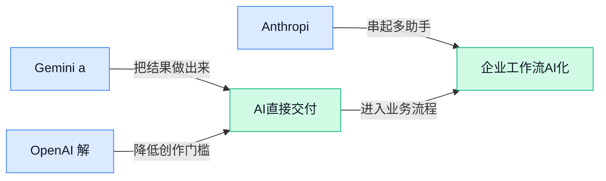

> AI 早报 · 每日早读 · 全网深度聚合

## **今日摘要**

```
Microsoft 财报亮剑，AI 业务同比暴增123%，Google Cloud 身后7000亿美元级AI军备竞赛升温
马斯克作证称xAI拿OpenAI模型训练Grok，OpenAI又严控GPT-5.5 Cyber，蒸馏争议直冲台前
Anthropic上线Claude Code自主编码工具，Meta商业AI每周促成1000万次对话，Agent落地开始拼真收入
```

### 🔵 产品与功能更新

1. **Gemini app 向 Android 推出 notebooks（笔记整理功能），iOS 同步迎来 Liquid Glass（液态玻璃风格界面）。**
Google 正在给 **Gemini app** 补齐更实用的日常功能：Android 端开始上线 **notebooks（把资料、想法和对话集中整理的笔记空间）**，方便用户把零散内容收拢到一个地方 💡。与此同时，iOS 版本则获得了 **Liquid Glass（更强调通透和玻璃质感的界面视觉样式）**，重点偏向观感更新。对普通用户来说，这类变化说明 AI 助手正在从“只会聊天”走向“顺手管理信息”的工具形态，移动端体验也在持续细化。[功能更新报道(briefing)](https://news.google.com/rss/articles/CBMicEFVX3lxTE5wSW1MYURhOXJOdVVmS1E0V0ZMVE5IaHdqZnE4bGlSR3pWVDlrR2daRUJsVGZuZ3BQZXFkU2V4SXo1dnB6amc4bmdFUTJGcEQ1bzY5UVR6VVhHci1qZHVIY0dFbVFZb3RiUC1CM1ZPUUU?oc=5)

2. **OpenAI 解释 goblin outputs（“哥布林式跑偏输出”，指模型出现古怪人格化回答）从何而来。**
OpenAI 专门发文复盘 **GPT-5** 一类模型里出现的 **goblin outputs（带明显怪异个性、容易跑偏的回答表现）**，交代了它们是怎么扩散、根因是什么，以及后来如何修复 🛠️。核心看点不是“模型闹笑话”，而是这类 **personality-driven quirks（被人格倾向带偏的小毛病）** 会影响用户对结果稳定性的信任。对公司里常用 AI 写文案、查资料、做总结的同事来说，这篇说明能帮助理解：为什么同一个工具有时很靠谱，有时却会突然“画风不对”。[官方问题复盘(briefing)](https://openai.com/index/where-the-goblins-came-from)

3. **Anthropic 发布 Claude Code Agentic Developer Tool（面向程序员的自主式编码工具）。**
Anthropic 推出的 **Claude Code** 这次被进一步强调为 **Agentic Developer Tool（能自己连续执行多步开发任务的程序员助手）**，不只是回答代码问题，而是朝“代你做一段工作流”迈进 🚀。这里的 **Agentic（自主执行型）**，可以理解为它会根据目标自己拆步骤、连续推进，而不是每一步都等人手动下指令。虽然这类工具首先服务开发者，但它释放出的信号很明确：AI 产品正在从“问答框”升级为“能直接干活的执行助手”。[发布消息报道(briefing)](https://news.google.com/rss/articles/CBMimwFBVV95cUxNLU5ld0I4VEx3S1owcFFxR3Zyd0FjNmRoMTlNQ0ptcXBLRFhMU2UzWmNnSElTenN1bVVCMHN5TUhsZDRVWWk0VEt6bXYzcDM4dE5aSDZLUExjbXBWcXJXRjZjZmNnZDl0ZXpUbXlGNF9ZLXRPdDdEZGEwbk1sbDNOVDVzc1FhMERDQ0d2N3c4bFowMnIwcGlTWjhpTQ?oc=5)

### 🟢 前沿研究

1. **Turning the TIDE（一种让扩散式大模型“瘦身”的蒸馏方法）：扩散大语言模型也能更小更强。**
这篇论文盯上了 **diffusion large language models（扩散式大语言模型，用“逐步去噪”方式生成内容的模型）** 体积大、门槛高的问题，提出 **cross-architecture distillation（跨架构蒸馏，把大模型能力迁移给另一种结构的小模型）** 新思路 💡。原文指出，这类模型虽然具备 **parallel decoding（并行解码，可同时生成多个位置而不是一个字一个字往外蹦）** 和双向上下文优势，但想做到有竞争力，往往得堆到数十亿参数。TIDE 的价值就在于：不是只在同类模型内部“压缩”，而是尝试跨不同模型架构传递能力，为更轻量的扩散大模型打开空间。对行业来说，这意味着未来这类模型更有机会从“实验室玩具”走向更可部署的产品形态 🚀。[arxiv 论文(briefing)](https://arxiv.org/abs/2604.26951)

2. **Operating-Layer Controls（运行层控制机制）：真金白银场景下的链上 Agent 可靠性研究。**
这项研究关注的是 **onchain language-model agents（链上语言模型 Agent，能调用区块链工具执行真实交易或操作的 AI 代理）** 在“带着真实资金干活”时，怎么更可靠、更不容易闯祸。论文基于 DX Terminal Pro 的 21 天部署，研究 **operating-layer controls（运行层控制，在模型真正执行动作前加上的规则、验证和约束）** 如何把用户指令转成经过校验的工具操作。简单说，这不是教 AI “更会说”，而是研究它在涉及资金时如何 **少犯错、能审计、可拦截**，这对金融、交易、自动化运营都很关键 ⚠️。如果未来 Agent 真要接手更高风险任务，这类“先把护栏装好”的研究会比单纯追求更强能力更重要。[arxiv 论文(briefing)](https://arxiv.org/abs/2604.26091)

3. **Google AI co-clinician（AI 临床协作助手）：Google DeepMind 探索医生身边的 AI 搭档。**
Google DeepMind 这篇文章讨论的是 **AI co-clinician（AI 临床协作助手，帮助医生整理信息、辅助判断的系统）**，目标不是替代医生，而是推动 **AI-augmented care（AI 增强型医疗服务，让医生在 AI 协助下看得更快更全）** 新模式。原文聚焦“研究路径”和系统建设方向，强调它是面向医疗场景的长期探索，而不是简单上线一个问答机器人 🩺。对非技术同事来说，最值得关注的是：医疗 AI 的重点正在从“会不会答题”转向“能不能嵌入真实工作流”，也就是能否在临床流程里稳定帮上忙。这个方向一旦成熟，对医院效率、医疗可及性和专业协作方式都可能产生持续影响。[官方研究文章(briefing)](https://deepmind.google/blog/ai-co-clinician/)

4. **GLM-5V-Turbo（智谱推出的多模态 Agent 基础模型）：冲着“原生多模态代理”去。**
这篇论文的目标很直接：把 **GLM-5V-Turbo（支持图文等多种输入的模型版本）** 打造成面向 **multimodal agents（多模态 Agent，既能看图读文又能执行任务的 AI 代理）** 的原生基础模型。这里的“原生”很关键，意味着它不是临时把多个能力拼起来，而是从底层就为多模态理解和任务执行去设计 🤖。对产品团队来说，这类模型更接近未来真正能“看懂界面、理解文档、再动手操作”的 AI 助手形态，而不只是聊天机器人。虽然候选信息里没有展开具体实验细节，但从论文定位看，研究重点已经明显从“会多模态”转向“能为 Agent 工作流服务”。[论文页面(briefing)](https://huggingface.co/papers/2604.26752)

5. **Multi-Task Autoencoders（多任务自编码器）：为联邦学习挑样本，缓解“数据各不相同”难题。**
这篇研究讨论 **federated learning（联邦学习，让多方在不直接共享原始数据的前提下共同训练模型）** 里的老大难：**non-IID data（非独立同分布数据，简单说就是各家数据差别很大、不在一个“口味”上）**。作者提出用 **multi-task autoencoders（多任务自编码器，一种能同时学习多种数据特征压缩表示的模型）** 做样本选择，目的就是在不集中数据的情况下，尽量挑出更有代表性的训练样本。这个问题听着学术，但现实意义很强——医疗、金融、政务等行业常常因为隐私或合规要求，不能把数据随便汇总，而数据差异又会拖累模型效果。若这类方法成熟，能帮助跨机构 AI 项目在“数据不能搬、质量还参差不齐”的情况下训练得更稳 📊。[论文页面(briefing)](https://huggingface.co/papers/2604.26116)

### 🟡 行业展望与社会影响

1. **Meta 称其商业 AI 每周已促成 1000 万次对话。**
这说明 **AI 客服/营销** 正在从“试试看”走向真正大规模落地：Meta 表示，它面向商家的 AI 已经每周处理 **1000 万次对话**，而且还有超过 **80 亿广告主使用人次** 用过至少一种 **生成式 AI**（让系统自动生成文案、图片或回复内容的 AI）工具 📈。对企业来说，这类能力最直接的意义是把获客、答疑、转化这些原本靠人工重复完成的工作，逐步交给机器先打底。想看原始表述，可参考 [TechCrunch 报道(briefing)](https://techcrunch.com/2026/04/30/meta-says-its-business-ai-now-facilitates-10-million-conversations-a-week/)。


2. **Microsoft 财报称 AI 业务同比增长 123%，AI 已不只是概念故事。**
Microsoft 在最新季度财报中表示，**AI 业务**同比增长 **123%**，这类数字之所以重要，是因为它代表 AI 正开始从“讲愿景”变成能体现在收入里的真生意 💰。对普通公司同事来说，这意味着未来采购软件、办公平台甚至数据服务时，**AI 功能** 很可能不再是附加项，而会成为标准配置。财报口径通常也会影响整个行业的投资预期和客户采购节奏，更多可见 [相关财报报道(briefing)](https://news.google.com/rss/articles/CBMi2gFBVV95cUxOTkZ2S1FHcTZrb2VWTjBEVHBGbE5DUVJzQ0hMbGRsLU5oX0s5eG5FUk0wc3d5Z0JlcHdJUDhaUWRWX2QyX3Y0OVJibk0xbWVrWF9xSWZ5TUpnZGV1VlhIVFh5LXVmODJsYkgza285SWZ0VDhSOEhKSjU4cmZrUDZ6cENySFdLc3VFZzNqTGZ4SWRvM0JzMXhuWC1vZ1VTNXpab0dQNkdsU0tIY3p0cGxPSkxOZThoa09pMVduWnpvQ3oxbkdQeHFYelh1Y29TSFo1ZkJpVE1NejVIdw?oc=5)。

3. **Google Cloud 领跑背后，是科技巨头把 AI 投资推高到 7000 亿美元级别。**
路透这则消息的重点不只是 **Google Cloud**（Google 的云计算业务，给企业提供算力、存储和 AI 服务）表现更强，还在于整个 **Big Tech**（大型科技公司）正在把 AI 投资总规模推到 **7000 亿美元** 量级 🚀。这意味着行业竞争已经从“谁模型更聪明”升级到“谁能长期投入数据中心、芯片和云基础设施”。对企业用户来说，好处可能是 AI 产品更成熟、选择更多；但另一面也说明未来市场会更集中，能持续烧钱做平台的玩家并不多。详情可看 [路透完整报道(briefing)](https://news.google.com/rss/articles/CBMivgFBVV95cUxOWVNydmRzT0dCVEZ3OEkzVDdnWW4tZFZJMU5zVTRMSE9ZNS1kRF9BTFFVbjJaMUItbnJZZEdyTjFUT014RmFVRUIzTkltdHljaFRiUHdnRHZDdjN6Z1NRbTVQMmFqMXE1d2dEN0hfdmw0SEl4Y2RrQmdGTnZHYUhjMFBNUzBJaFhES2RBcEtEbmpLVHVkR3VkZkFsb1dDQ1U5dFJ0dW9lVnh3VHhUNWZWN212a3pjS3UtM2gwd2ln?oc=5)。

4. **马斯克作证称 xAI 用 OpenAI 模型训练 Grok，模型“蒸馏”争议再升温。**
这里的核心词是 **distillation（模型蒸馏，把大模型的能力“提炼”给更小模型，像把老师的解题思路浓缩给学生）**。TechCrunch 指出，当前顶尖实验室都在努力阻止较小竞争者通过这种方式“复制”自家模型能力，因此这已经不只是技术细节，而是牵涉到 **知识产权**、竞争边界和行业规则的大问题 ⚖️。对外界来说，这件事释放的信号很明确：未来围绕“模型到底算不算被抄、如何界定训练来源”的争论只会更多。原文可见 [TechCrunch 争议报道(briefing)](https://techcrunch.com/2026/04/30/elon-musk-testifies-that-xai-trained-grok-on-openai-models/)。

5. **OpenAI 也开始限制 GPT-5.5 Cyber（网络安全测试工具）访问，安全能力进入“先严控后开放”阶段。**
这条新闻的微妙之处在于：OpenAI 此前批评 Anthropic 限制 **Mythos**，但如今自己也决定先只向“关键网络防御者”开放 **GPT-5.5 Cyber**（用于网络安全测试的 AI 工具）🔐。这反映出一个越来越明显的行业共识：某些高风险能力，哪怕技术上已经能做，也不会一上来就全面放开。对企业和公共机构来说，这意味着 **AI 安全** 不只是“能不能用”，更是“谁能先用、在什么场景下用、需要什么审核”。更多细节可参考 [TechCrunch 限制措施报道(briefing)](https://techcrunch.com/2026/04/30/after-dissing-anthropic-for-limiting-mythos-openai-restricts-access-to-cyber-too/)。

### 🟣 开源TOP项目

1. **cua（面向电脑操作型 Agent 的开源基础设施）让 AI 真正“会用电脑”。**
这个项目主打 **Computer-Use Agents（电脑操作型 Agent，能像人一样点按钮、切窗口、操作完整桌面）** 所需的底层能力，提供 **sandboxes（沙箱环境，把 AI 隔离在可控测试空间里）**、**SDK（软件开发工具包，方便开发者快速接入能力）** 和 **benchmarks（基准测试，用来统一评估效果的标准题）**。它覆盖 **macOS、Linux、Windows** 三大桌面系统，重点是帮助团队训练和评估“能直接操作电脑”的 AI，而不只是聊天机器人 💡。对企业来说，这类项目的意义在于：未来很多跨系统、跨软件的重复操作，都可能被 Agent 自动接手。[GitHub 项目主页(briefing)](https://github.com/trycua/cua)


2. **codeburn（AI 编程成本可视化看板）帮你看清 token 到底花在哪。**
如果团队在用 Claude Code、Codex、Cursor 做 AI 编程，这个项目解决的是一个很现实的问题：**token（模型处理文字时的计量单位，像 AI 的“字数/算力账单”）** 花得太快，却不知道烧在了哪里 🔍。它提供 **TUI dashboard（终端交互式看板，不开网页也能在命令行里查看数据）**，用于做 **cost observability（成本可观测性，把费用变化看清楚、追踪清楚）**。说白了，它像给 AI 编程加了个“费用仪表盘”，适合想控制预算、优化使用习惯的团队。[项目仓库说明(briefing)](https://github.com/getagentseal/codeburn)


3. **Warp（从终端长出来的 Agent 式开发环境）想把命令行升级成 AI 工作台。**
Warp 把自己定义为 **agentic development environment（Agent 式开发环境，AI 不只是回答问题，而是能参与完成开发任务）**，而且是从 **terminal（终端，程序员输入命令操作电脑的黑底白字界面）** 演化出来的。这个定位很值得关注：它不是单纯给终端加聊天框，而是想把原本“敲命令”的地方，变成 AI 协作完成任务的入口 🚀。对不写代码的同事也可以这样理解——它代表一种趋势：未来很多专业软件界面，都会从“工具”变成“能一起干活的助手”。[GitHub 开源页(briefing)](https://github.com/warpdotdev/warp)


4. **Beads（给编程 Agent 增加记忆力的工具）瞄准 AI 老忘事的痛点。**
这个项目一句话很直白：它是给 **coding agent（编程 Agent，帮人写代码和处理开发任务的 AI 助手）** 的 **memory upgrade（记忆升级，让 AI 更好记住上下文和历史信息）**。很多 AI 编程体验不稳定，问题往往不只是“不会写”，而是记不住前面做过什么、项目规则是什么 🧠。Beads 的价值就在于补这块短板：让 Agent 在连续任务里更连贯，减少反复解释背景的成本。对团队协作来说，这意味着 AI 更可能从“单次回答机器”升级为“持续跟进的数字同事”。[项目主页介绍(briefing)](https://github.com/gastownhall/beads)

5. **claude-code-templates（Claude Code 的命令行配置与监控工具）让使用更规范。**
这个项目是一个 **CLI tool（命令行工具，用输入文字命令的方式管理程序）**，用于配置和监控 Claude Code。它的价值不在“再造一个 AI”，而在于把日常使用过程做得更有条理：包括配置方式更统一、运行状态更容易跟踪 📌。对团队来说，这类工具通常意味着更方便做标准化管理，尤其适合多人一起使用 AI 编码助手的场景。[GitHub 仓库页(briefing)](https://github.com/davila7/claude-code-templates)

6. **lingbot-map（基于流式数据重建场景的 3D 基础模型）瞄准空间理解能力。**
这个项目是一个 **3D foundation model（3D 基础模型，先学会通用空间理解能力、再适配具体任务的大模型）**，用于从 **streaming data（流式数据，边接收边处理的连续输入数据）** 中重建场景。摘要里提到它采用 **feed-forward（前馈式处理，一次向前计算得出结果，不靠反复回看历史）** 架构，重点在于把持续到来的数据快速转成三维场景表示 🌐。这类能力对机器人、空间地图、实时环境感知都很关键，也说明开源项目正从文本生成逐步走向“理解真实世界”。[GitHub 项目链接(briefing)](https://github.com/Robbyant/lingbot-map)

### 🔴 社媒分享

1. **Granite 4.1（IBM 开源的大模型家族）用 8B（约 80 亿参数）追平 32B MoE（混合专家模型，用多个“小专家”分工协作的大模型）。**
这条分享最吸睛的点在于：IBM 用更小的 **8B 模型**，去对标体量更大的 **32B MoE**，传递出一个很现实的行业信号——不一定非要“越大越强”，**效率**和**成本**也越来越重要 💡。对企业用户来说，这类模型如果真能做到“小模型打大模型”，意味着部署门槛、推理成本（模型回答问题时消耗的算力成本）和落地难度都可能更友好。原文聚焦在 **Granite 4.1** 这一开源模型家族的表现与定位，适合关注企业级 AI 选型的人快速了解趋势。[完整介绍(briefing)](https://firethering.com/granite-4-1-ibm-open-source-model-family/)


2. **DeepSeek 发布 Thinking-with-Visual-Primitives（“用视觉基本元素来思考”的研究框架），联合北大清华探索视觉推理新路线。**
这项工作来自 DeepSeek 与北京大学、清华大学合作发布的论文，核心是让模型借助 **visual primitives（视觉基本元素，把图像拆成更基础的形状、结构或部件来理解）** 进行思考，而不只是“看图说话” 👀。如果这条路线有效，未来 AI 在看图分析、空间理解、图形推理等任务上，可能会更像“先拆解、再判断”，而不是直接猜答案。对普通用户而言，这意味着视觉 AI 未来可能更稳、更会解释“自己为什么这么看”。[Reddit 讨论帖(briefing)](https://www.reddit.com/r/LocalLLaMA/comments/1szwi1d/deepseek_released_thinkingwithvisualprimitives/)


3. **亚马逊财报透露：Trainium（亚马逊自研 AI 训练芯片）押注开始见效，行业重心正从训练转向推理和 Agent。**
这篇分析认为，亚马逊近来的财报表现，某种程度上印证了一个关键变化：AI 行业正在从大规模**训练**，逐步转向更贴近商业落地的 **inference（模型推理，让训练好的模型真正对外回答问题）** 和 **Agent（能自动执行多步任务的 AI 助手）** 🚀。在这个背景下，**Trainium** 这类自研芯片的价值开始凸显，因为企业更关心“把 AI 跑起来并长期使用”的成本，而不只是把模型训出来。文章还补充谈到广告、Agent 和体育版权等业务观察，适合把它当作“财报背后的 AI 产业风向”来看。[分析原文(briefing)](https://stratechery.com/2026/amazon-earnings-trainium-and-commodity-markets-additional-amazon-notes/)

4. **“我们需要 RSS（网站更新订阅格式）来分享海量 vibe-coded apps（靠自然语言快速做出来的应用）。”**
这篇文章讨论了一个很接地气的问题：现在用 AI “边聊边做”生成的小应用越来越多，但发现、订阅、持续追踪它们却很难，作者因此呼吁回到 **RSS** 这种简单直接的分发方式 📡。这里的 **vibe-coded apps**，可以理解为“不是传统严谨开发流程产出的软件，而是借助 AI 快速生成、快速试错的小工具”。对内容平台、产品团队和运营同学来说，这其实点中了一个新需求：当应用生产速度暴涨，**分发机制** 反而会变成下一轮瓶颈。作者还提到 **Atom（和 RSS 类似的网站订阅格式）**，强调开放订阅标准在 AI 应用时代依然有价值。[原文评论(briefing)](https://simonwillison.net/2026/Apr/30/rss-vibe-coded-apps/#atom-everything)

5. **Claude Code 因提交记录提到 OpenClaw（一个项目名）而拒绝请求或额外收费，引发社媒热议。**
这条社媒内容的焦点不是功能更新，而是一次很具体的使用争议：有人称在 **commits（代码提交记录，开发者每次保存改动时写下的说明）** 中提到 **OpenClaw** 后，Claude Code 会出现拒绝请求或额外收费的情况 😮。如果情况属实，这会让开发者担心工具是否会基于项目名称、上下文内容或使用场景做额外限制，也会把“AI 编码助手的规则边界”再次推上台面。由于目前这里主要是社交平台上的个体反馈，更适合把它理解为一条值得关注的用户观察，而不是官方结论。[社媒原帖(briefing)](https://twitter.com/theo/status/2049645973350363168)

---



### 📊 行业洞察（今日 4 条）

1. Google 为 Gemini app 上线 notebooks（笔记整理空间），iOS 版更新 Liquid Glass（液态玻璃界面）。
  【洞察】判断是助手正从聊天转向信息管理入口，因为先补收纳能力而非只做视觉翻新；机会在提高留存，风险是同质化加剧。

2. OpenAI 复盘 GPT-5 的 goblin outputs（怪异人格化输出）成因，并说明扩散与修复过程。
  【洞察】判断是行业竞争重心转向稳定性与可信度，因为跑偏会直接伤害结果信任；机会在质量治理，风险是品牌受损更快放大。

3. Anthropic 发布 Claude Code，强调 Agentic Developer Tool（自主执行型开发工具）定位。
  【洞察】判断是 AI 正从问答产品走向执行产品，因为其卖点已是连续完成多步任务；机会在提效，风险是错误动作成本高于错误回答。

4. Meta 称商业 AI 每周促成 1000 万次对话，Microsoft 财报披露 AI 业务同比增长 123%。
  【洞察】判断是企业级 AI 已进入收入验证阶段，因为使用量与财报同时给出需求信号；机会在预算释放，风险是客户更看重可量化回报。

### 💭 对我们的启发（今日 3 条）

1. 参考 Claude Code 的多步执行定位，我们的平台应把 Agent 间协作、状态交接做成核心能力；机会是切入执行层，风险是结果失误责任更重。

2. 参考 OpenAI 对 goblin outputs 的复盘，A2A 平台要内建行为评测与回溯机制；机会是把可靠性做成卖点，风险是治理成本会压缩交付速度。

3. 参考 Meta 与 Microsoft 的商业信号，市场进入看 ROI（投资回报）阶段；我们应优先攻入可度量场景，机会是更易成交，风险是通用叙事吸引力下降。


---

> 本周周报：[第18周综合分析](https://ylzsdafei.github.io/ai-daily-site/blog/weekly/2026-w18/)
