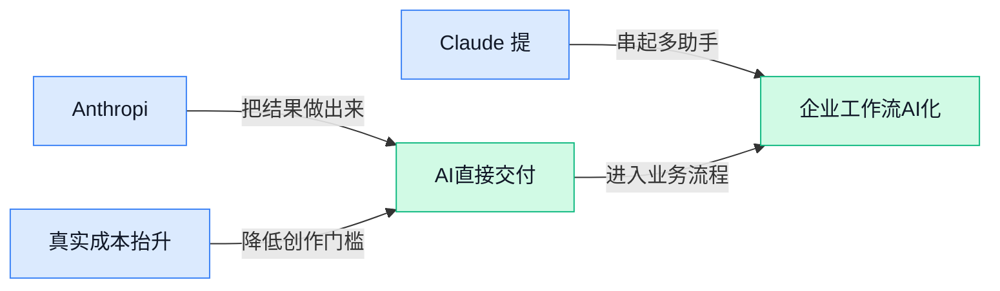

> AI 早报 · 每日早读 · 全网深度聚合

## **今日摘要**

```
Anthropic 一口气推 10 个金融 AI Agent 并接入 Microsoft 365，Claude 使用上限同步拉高
Anthropic 搭上 SpaceX Colossus-1 迈入 22 万张 GPU 时代，还承诺未来五年向 Google Cloud 投 2000 亿美元
OpenAI 向中小企业开放 ChatGPT 广告自助平台，Google 用 multi-token prediction 把 Gemma 4 提速到 3 倍
```

### 🔵 产品与功能更新

1. **Anthropic 面向银行与资管推出 10 个 AI Agent（可自动执行一类工作的智能助手）。**
这批新工具明显是冲着**金融专业场景**来的，不是泛聊天，而是给银行和**资产管理**从业者直接上手用的 🚀。对业务同事来说，这类垂直化 Agent 的意义在于：AI 不再只是“会回答问题”，而是更像按岗位分工的数字同事，能围绕具体流程提供支持。若后续落地顺利，金融行业里原本依赖大量人工整理、分析、响应的工作，可能会更快被标准化和自动化。[相关报道(briefing)](https://news.google.com/rss/articles/CBMixAFBVV95cUxNR1I4Tk9hRlE1anJvczJHVFMtWXBBNWN1QW5kSmNHaWtwZXhHaXI4M1d2aGNaZnFCVXdxWHpMYXB4NEh4TTlYdkxUUVpGSWNSajVYQmJ1cDZldDFlZjFVZ3l4Skx3UnBDa2dMNnpqV19fVnRaTUwzR1hnSXdWTHVsblhnX1NJT1NJWDkzX2RER0F5XzhMaDlrTnByaTcyaGJGaHhIbFVCUEdRWDF2Vzh0UHpqVXNpQVl5dlJoTHE5SnV0YVBl?oc=5) 💡

2. **Anthropic 为金融服务行业上线 AI Agent 模板，并接入 Microsoft 365（微软办公套件）集成。**
这次更新不只是在“造模型”，而是在补齐**企业落地**最关键的一环：模板 + 办公系统集成 ✨。所谓 **template（模板，预先配好的工作流程骨架）**，能让企业少走很多从零搭建的弯路；而接入 Microsoft 365，则意味着 AI 更容易进入大家熟悉的文档、邮件、协作流程里。对公司管理层和职能团队来说，这种更新往往比单纯参数升级更重要，因为它更接近“今天就能试、明天就能上线”的状态。[完整报道(briefing)](https://news.google.com/rss/articles/CBMitgFBVV95cUxPRmpISElNS3RZUzREQmFfUDRYZUpjQmNIbFFDUlpZeGFLbU9GcmpvMXJZa2NBMllfNUY4V0FpSkpxODRJWlBpRUYyM0d1OThtSXpDeFZqaHo5eU1qMEp3OG9wSEpyX19pRkM1NWdmWHRkZkZ1VG5va2NKTk40UEVTTE9WR1VRQzAwVDlEQ2RzRkppWlJ2alpMbndjT1QzaEpzVEV6TUZqOFlkcUlsa0Iya1ZXZDN4UdIBuwFBVV95cUxPMkhtY3EwRERQUkRlUnN2cFk1LVM3dDNYb2dDb3ZfVmdMY0xtOXJ1N0dhNlhXejNJenBHd3JRYzQtTWNZa3BCQkRHWmlCRHZVTzdTZWtFNnR2cG9pY0VmMTd4TmJGMlFaS2ZjSlppa2RmN1Y5X2dMUmtWODk3emZrQVIxQkE0SHpYaXBpUV81RU5TNmM5aXF6Tjk5bnRwSGJaNVI4Y1VySDhHV3ZzRWI1eUlyUFozdXowQXpv?oc=5)

3. **Claude Opus 4.7（Claude 系列的新模型版本）亮相，报道称其能力仅次于 Mythos（报道提到的另一款更强模型）。**
从报道表述看，Anthropic 这次主打的是**模型能力升级**，把 Claude 产品线继续往高性能方向推进 ⚡。对普通用户来说，模型版本更新通常意味着更好的理解、推理和任务完成表现；对企业用户来说，则关系到它能否胜任更复杂的分析与生成工作。值得注意的是，原文强调其在能力排名上“位居第二”，说明大模型竞争已经越来越像产品线之间的正面较量，而不只是实验室里的技术秀。[新闻原文(briefing)](https://news.google.com/rss/articles/CBMi8AJBVV95cUxPcEJENFRwOGVMWVcydmV6aTRNQXJzMVJfM3NPeVEyM2g5bFRkTlZlU2QwUEc3VFNieG5HV0x0V1Q2bmN3Unc2dEJmZ3FPTVZvRmRQbFBRb1NlbnkwZ2ZVekpWc1l5VGlULXNuUVFLaTZHUzItTllpdnBaMF9SMkNRNjRzOVUxT1pfY1diSUZjSWlBMVJ0TjZwZkphWlN2R0lHb0hTUDZkb2loY0l6VEZiUFFfWUpCYmhLNmljaEN2NExaUXluWnBwbU1LR1BuREFJXzc5OE5BRHU3SGR4bUhOV3lkbW81R0FQU2QzdUlqQThfeGxYMFlrRTR1RUpHUm1ielBWbkotNlRwNW9zSEZUNEZ3X2VTblNyU2RGMlRMMk9IUmNZT1ZFSkYtU1RYRXQ0OXpuQjFwc09aYWxKZ3dMTVptYnZpQkVObUgzSFdpazF4SUhCY200SWV3R3JYVTdOY3ZncnV3YldqWWpjS3dDTQ?oc=5) 💡

### 🟢 前沿研究

1. **Google 用 multi-token prediction（一次预测多个词元, 让模型少走几步）把 Gemma 4 提速到 3 倍。**  
这项研究的重点不是把模型“练得更大”，而是让它在**生成回答**时更高效：传统做法一次只预测一个 token（词元，把一句话拆成模型处理的小块），而 **multi-token prediction** 会一次往前多看几步，所以速度明显提升 ⚡。对普通用户来说，这意味着同样的模型有机会做到**更快回复、成本更低**；对企业和开发者来说，则可能降低部署本地模型的门槛。Gemma 4 是 Google 的**开源模型**路线之一，这次优化也说明，前沿竞争不只比谁更聪明，也在比谁更省资源、更适合真实落地。[完整报道(briefing)](https://the-decoder.com/google-speeds-up-gemma-4-threefold-with-multi-token-prediction/)

2. **Healthcare AI GYM（面向医疗 AI 智能体的训练与评测平台）瞄准“先练再上岗”的医疗 Agent。**  
这篇工作从名字就能看出思路：给**医疗智能体**搭一个像“健身房”一样的环境，在正式接触真实医疗任务前先反复训练和测评 🏥。这里的 Agent 是能自主完成多步任务的 AI 助手，而医疗场景又格外强调**可靠性**和**流程规范**，所以这类平台的重要性很高。对行业来说，它释放出一个信号：医疗 AI 不会只比模型会不会答题，还会越来越看重**可验证、可演练、可评估**的实战能力。[论文页面(briefing)](https://huggingface.co/papers/2605.02943)

3. **Beyond SFT-to-RL（超越“先监督微调再强化学习”老路径）提出多模态模型的预对齐新思路。**  
这篇论文聚焦 **SFT**（监督微调，用标准答案先把模型教会基本格式）与 **RL**（强化学习，让模型在反馈中继续优化）之间的衔接问题，想解决多模态模型在进入强化学习前“底子不稳”的情况 💡。其中的 **pre-alignment**（预对齐，先让模型行为更贴近人类期望）和 **black-box on-policy distillation**（黑盒在策略蒸馏，让学生模型模仿老师模型当前决策方式）都是为了让后续训练更顺。对非技术团队可以简单理解为：研究者在想办法让会看图、会理解文字的 AI，先把“做事风格”校准好，再进入更激进的能力提升阶段。[论文页面(briefing)](https://huggingface.co/papers/2604.28123)

4. **StateSMix（一种结合状态空间模型与上下文混合的新压缩方法）探索“无损压缩”新路线。**  
它研究的是 **lossless compression**（无损压缩，压缩后还能完整还原原始内容），目标不是让 AI 更会聊天，而是让数据存储和传输更省空间 📦。论文把 **Mamba state space models**（一种擅长处理长序列的新模型结构）和 **sparse N-gram context mixing**（稀疏 N 元语境混合，用更精简的方式利用上下文规律）结合起来，想在在线压缩场景里拿到更好效果。虽然这听上去偏底层，但它关系到未来 AI 系统处理海量文本、日志和知识库时的**基础效率**，属于“看不见却很关键”的底座型研究。[论文页面(briefing)](https://huggingface.co/papers/2605.02904)

5. **《Generate, Filter, Control, Replay》（大模型强化学习 rollout 策略综述）系统梳理“AI 训练时怎么练”。**  
这是一篇综述型论文，讨论 **rollout**（让模型按当前能力跑一遍任务过程，再根据结果学习）在大模型强化学习里的几种主流策略：生成、筛选、控制、回放。它的价值不在于发布新模型，而在于帮研究者和企业看清：不同训练路线各自适合什么目标、有什么代价、有哪些常见坑 🧭。如果把大模型训练比作培养员工，这篇文章更像是一份“培训方法大全”，帮助大家理解为什么现在 AI 能力提升越来越依赖**训练流程设计**，而不只是堆更多数据和算力。[论文页面(briefing)](https://huggingface.co/papers/2605.02913)

6. **HeavySkill（把“重思考”变成智能体内在技能）想提升 Agent 的复杂任务处理力。**  
这项研究强调，Agent 想真正能干活，不只是会调用工具，还得具备 **heavy thinking**（重思考，面对复杂问题时愿意花更多步骤做拆解、验证和反思）的内在能力 🤖。标题里的 **agentic harness**（智能体运行框架，可理解为把模型、工具和任务流程串起来的“工作台”）说明它关心的是智能体在真实执行链路里的表现。对业务同事来说，这类研究的意义很直接：未来好用的 AI 助手，差别可能不在“会不会说”，而在“遇到复杂任务时能不能想得更深、犯错更少”。[论文页面(briefing)](https://huggingface.co/papers/2605.02396)

7. **Chain of Evidence（证据链框架）让 RAG（检索增强生成, 先查资料再回答）学会在图像里标出“答案证据”。**  
这篇论文关注的是**视觉场景**下的 RAG：AI 不只是从资料里找答案，还要在图像中指出到底是哪一块区域支持这个结论 👀。其中的 **pixel-level visual attribution**（像素级视觉归因，精确到图像局部去解释“为什么这么回答”）很关键，因为它能增强结果的可解释性；而 **iterative**（迭代式，多轮反复检索和修正）则说明模型不是一次查完就结束。对医疗影像、工业巡检、设计审核等场景来说，这类研究尤其有价值，因为很多时候大家不仅要答案，还要**看得见、说得清的证据链**。[论文页面(briefing)](https://huggingface.co/papers/2605.01284)

8. **OpenAI 的 B2B Signals（企业级 AI 采用研究）总结前沿企业如何把 AI 变成持续优势。**  
这份研究关注的不是单个模型新功能，而是企业如何把 AI 真正用进业务流程，形成更难复制的**竞争壁垒**。文中提到 **Codex-powered agentic workflows**（由 Codex 驱动的智能体工作流，让 AI 自动完成多步协作任务）等实践，说明领先企业已经从“员工偶尔用一下 AI”走向“把 AI 嵌进正式生产流程” 🚀。对管理层和中后台团队来说，最值得关注的是：AI 优势不是买一个工具就结束，而是看谁能更快形成**组织级采用、流程级改造、规模化复用**。[OpenAI 研究页面(briefing)](https://openai.com/index/introducing-b2b-signals)

### 🟡 行业展望与社会影响

1. **Anthropic 搭上 SpaceX Colossus-1（超大规模 AI 数据中心）算力，Claude 背后进入“22 万张 GPU”时代。**
这条消息最值得关注的，不只是两家公司合作，而是 **AI 算力** 正在变成真正的基础设施竞赛 🚀。报道提到 Anthropic 将使用 SpaceX 的 Colossus-1（超大规模 AI 数据中心）和 **220,000 块 GPU**（图形处理器，现已成为训练和运行大模型的核心硬件），来支撑 Claude 的训练与服务能力。[完整报道(briefing)](https://the-decoder.com/anthropic-taps-spacexs-colossus-1-data-center-for-220000-gpus-to-power-claude/) 这意味着头部模型公司的门槛，越来越不只是“模型聪不聪明”，还包括“谁能拿到更大规模、更稳定的算力供应” 💡。对行业来说，未来 AI 竞争会越来越像电力、云计算一样，拼的是长期资源调度能力而不只是单次产品发布。


2. **Anthropic 未来五年承诺向 Google Cloud（Google 的云计算平台）投入 2000 亿美元，AI 巨头开始签“超长期算力合同”。**
这笔承诺非常能说明一个趋势：**大模型公司正在把云资源当作长期战略物资来锁定**。Google Cloud（Google 的云计算平台，相当于企业租用服务器和 AI 基础设施的地方）拿到这类超大单，说明训练、部署和日常 **inference（模型推理，让训练好的模型真正回答用户问题的过程）** 所需的资源，已经贵到必须提前多年规划。[完整报道(briefing)](https://the-decoder.com/anthropic-commits-200-billion-to-google-cloud-over-five-years/) 对普通企业用户来说，这会进一步强化头部厂商优势：谁能锁定更多算力，谁就更可能提供更稳定、响应更快、功能更新更勤的 AI 服务。换句话说，AI 行业正在从“模型创新赛”走向“模型 + 基建 + 资本”的综合战。


3. **Claude 提高使用上限，AI 工具正从“偶尔帮忙”走向“全天候工作搭子”。**
Anthropic 这次不仅谈了算力合作，还同步上调了 Claude 套餐的使用限制，释放出一个很直接的信号：用户已经在更高频、更重度地把 AI 当生产工具来用 📈。[官方说明(briefing)](https://news.google.com/rss/articles/CBMiYEFVX3lxTE50ZXhOWkRpY080blQ2aDkzS1Fwb3FYWUhGM3FGUzNIbWNyYXY4cVZMaDYxMDVFejU1UGFkblVXMDdwMHJFQldvRXBUeXpJYUR5amgxelJtZ3dTU0U2dk1Taw?oc=5) 对文职、运营、客服、市场等岗位来说，**使用上限** 提升的意义很现实——长文整理、反复修改、多人协作场景里，不容易“用着用着就撞限额”。而从行业角度看，平台愿意放宽额度，往往也意味着它对自身 **compute（计算资源，也就是支撑 AI 运行的服务器和芯片能力）** 供应更有底气了。AI 助手接下来比拼的，可能不只是能力强弱，还包括“能不能稳定陪你干一整天”。

4. **OpenAI 向中小企业开放 ChatGPT 广告自助平台，聊天入口开始变成新流量入口。**
如果这条消息持续推进，影响可能不亚于当年搜索广告的普及：**ChatGPT** 不再只是回答问题的工具，也在逐步成为商家投放推广的新场景。报道提到，OpenAI 正把广告能力开放给中小企业，并建设完整的 **self-serve ad platform（广告自助投放平台，商家自己就能开账户、设预算、投广告）**。[完整报道(briefing)](https://the-decoder.com/chatgpt-ads-are-now-open-to-small-businesses-as-openai-builds-a-full-self-serve-ad-platform/) 这意味着未来品牌、零售、本地服务甚至招聘等业务，都可能要重新思考“用户在对话里做决策”这件事 💡。对公司里的市场、运营同事来说，一个新问题来了：当用户不再先搜网页，而是先问 AI，广告和内容该怎么被看见？

### 🟣 开源TOP项目

1. **OmniGet（一个聚合多平台下载与传文件的桌面工具）把“下载分散在各处的内容”这件事做成了一站式。**
它主打 **桌面端** 统一下载，支持 YouTube、抖音、B 站、Instagram 等 **1000+ 平台**，底层基于 yt-dlp（一个非常流行的多网站视频下载开源工具，像“万能抓取器”）来完成内容获取 🚀。除了视频和课程资源，它还支持 **torrent（点对点下载文件的分发方式，适合大文件多人共享）**，并能通过 **P2P（设备之间直接传文件，不必先上传到云端）** 在设备间传文件，实用性很强。对经常做素材收集、课程整理、跨设备搬运文件的同事来说，这类工具的价值很直接：少装一堆软件、少切很多网站。[GitHub 项目页(briefing)](https://github.com/tonhowtf/omniget)


2. **vscode-dark-islands（给 VSCode 用的深色主题皮肤）用一套更有层次感的界面改善编码观感。**
这是一个面向 VSCode（微软推出的代码编辑器，很多开发者日常写代码都在用）的 **深色主题**，灵感来自 easemate IDE（一个集成开发环境，也就是把写代码、调试、运行放在一起的开发工具）和 JetBrains islands theme（JetBrains 系列开发工具中的一种视觉主题）💡。虽然它不是“大功能型”项目，但这类主题项目往往能明显提升长时间工作的 **可读性** 和 **视觉舒适度**。对设计、产品或运营同事来说，也能看出一个趋势：开源社区不只卷模型和功能，连“工作界面的体验细节”也在持续打磨。[GitHub 仓库(briefing)](https://github.com/bwya77/vscode-dark-islands)


3. **cursor/cookbook（Cursor 官方的示例与最佳实践仓库）在帮用户把 AI 编码工具用得更顺手。**
从仓库名看，它更像一份 **cookbook（实践手册，提供可直接照着用的示例集合）**，通常这类项目的核心价值不在“新功能”，而在于把零散能力整理成可复用的方法 🧭。对于使用 Cursor 的团队来说，这种官方示例仓库能帮助大家更快理解 **工作流（完成一类任务的标准步骤）** 怎么搭、常见场景怎么落地。它也反映出一个很现实的行业方向：AI 工具竞争，已经不只是“模型强不强”，还包括“别人能不能马上学会并真正用起来”。[官方仓库入口(briefing)](https://github.com/cursor/cookbook)


4. **DocuSeal（开源电子签名文档平台）瞄准 DocuSign 替代场景，把签文件这件事做得更自主。**
这个项目主打 **开源** 的电子文档签署能力，支持创建、填写和签署数字文件，相当于一个可自建的 DocuSign 替代方案 ✍️。对企业来说，这类工具的吸引力在于：如果你有合同、审批单、确认函等流程，就可能希望把签署系统掌握在自己手里，而不是完全依赖外部平台。对行政、人事、法务、财务协作场景尤其有意义，因为它直连的是高频又刚需的 **文档流转** 与 **电子签署**。[GitHub 项目页(briefing)](https://github.com/docusealco/docuseal)

### 🔴 社媒分享

1. **微软财报谈“Agentic business model（以 Agent 为核心的商业模式）”，苹果财报则直面内存与芯片短缺。**
这篇分析把两家巨头的财报放在一起看：**微软**正在把 **Agent** 从单点功能推进到更完整的商业模式，而**苹果**则一边受制于**内存**和**芯片供应**，一边让 **Mac** 借着 AI 获得新卖点 💡。对普通职能同事来说，最值得关注的是：AI 已不只是“加个聊天框”，而是在改写大公司的**卖货方式**和**硬件节奏**。如果你想快速理解这轮财报背后的产业信号，可以直接看 [财报深度解读(briefing)](https://stratechery.com/2026/microsoft-earnings-apple-earnings/) 🚀


2. **Gemma 4 MTP（Google 推出的多词同时预测版模型）发布，主打更快生成。**
这次更新的核心是 **MTP（Multi-Token Prediction，多词同时预测，让模型一次往前“多写几步”）**，和传统一次生成一个词相比，目标是提升**输出速度**与使用体验 ⚡。相关讨论提到官方博客和 HuggingFace（全球最大 AI 模型共享社区）上的模型资源，说明它不只是研究概念，而是开发者已经能上手试。对业务团队的意义很直接：未来同样的 AI 功能，可能会变得**更快、更省等待时间**，用户体感提升往往比参数数字更重要。[官方博客说明(briefing)](https://blog.google/innovation-and-ai/technology/developers-tools/multi-token-prediction-gemma-4/) [社区讨论串(briefing)](https://www.reddit.com/r/LocalLLaMA/comments/1t4jq6h/gemma_4_mtp_released/)

3. **Anthropic 提高 Claude 使用上限，并与 SpaceX 达成算力合作。**
Anthropic 这次一口气释放了两个信号：一是 **Claude** 的**使用额度提高**，二是和 **SpaceX** 谈下了**compute（算力，也就是支撑模型运行的数据中心计算资源）**合作 🤝。这说明当用户规模和模型能力继续上升时，AI 竞争不只是拼模型聪不聪明，也在拼谁能拿到足够稳定的 **GPU cluster（显卡集群，训练和运行大模型的核心硬件设施）**。对企业用户来说，更高上限通常意味着能把 Claude 放进更重度、更连续的工作流里，而不是浅尝辄止。[Anthropic 官方发布(briefing)](https://www.anthropic.com/news/higher-limits-spacex)

4. **Learning the Integral of a Diffusion Model（学习扩散模型整体轨迹的方法）尝试让生成过程更可控。**
这篇文章讨论的是 **Diffusion Model（扩散模型，一类常见的图片/视频生成模型）** 不只是“逐步去噪”，还可以从“整体轨迹”角度去理解与学习它 🧠。文中的 **Integral（积分，这里可理解为把一连串微小变化看成完整路径）** 思路，重点在于更高效地描述模型怎样一步步走到最终结果。对非技术同事来说，可以把它理解为：研究者在想办法让生成模型少走弯路、更稳定，这类底层改进虽然不直接面向消费者，却可能慢慢影响未来 AI 工具的**速度、成本和一致性**。[原文详解(briefing)](https://sander.ai/2026/05/06/flow-maps.html)

5. **vLLM（高性能大模型推理引擎）从 V0 到 V1，强调“Correctness Before Corrections（先保证答对，再谈后续修正）”在 RL（强化学习，让模型通过反馈不断调整）中的价值。**
这篇来自 HuggingFace 的文章，聚焦 **vLLM** 在版本演进中的经验，核心观点是：在 **RL** 训练里，先把“基础正确性”打牢，比一味依赖后续纠错更关键 🔍。这里的 **inference（模型推理，让训练好的模型真正回答问题的过程）** 系统如果底层不稳，后面的训练和优化很容易建立在偏差之上。对企业落地而言，这其实是在提醒大家：AI 项目别只看演示效果，底层稳定性和正确率才决定它能不能进正式业务流程。[HuggingFace 技术文章(briefing)](https://huggingface.co/blog/ServiceNow-AI/correctness-before-corrections)

6. **《The Trump administration's AI doomer moment》（特朗普政府的“AI 悲观派时刻”）折射出美国政策圈对 AI 风险的升温。**
这篇报道关注的是美国政治与政策圈里，围绕 AI 的**风险担忧**正在变得更强，而不再只是科技公司和研究者之间的讨论 🌐。标题里的 **doomer（强烈担心技术失控或负面后果的人）**，反映出一种越来越鲜明的监管情绪：AI 不只代表生产力机会，也被视为潜在的社会与治理挑战。对公司内部做管理、合规、运营的同事来说，这类风向值得关注，因为政策态度的变化，往往会影响企业客户采购、数据治理和外部传播口径。[完整报道(briefing)](https://www.platformer.news/trump-administration-doomers-ai/)

---



### 📊 行业洞察（今日 4 条）

1. Anthropic面向银行与资管推出10个AI Agent（可自动执行一类工作的智能助手），并上线金融模板接入Microsoft 365（微软办公套件）。
  【洞察】AI正从通用问答转向岗位化交付，因为模板加办公入口降低试用门槛；机会是更快签单，风险是场景易被大厂预置方案占领。

2. Anthropic提高Claude使用上限，并接入SpaceX Colossus-1超22万张GPU（图形处理器）资源。
  【洞察】头部竞争已转向产品能力与基础资源双线并进，因为更高额度背后是重度使用增长；机会是企业需求变深，风险是中小厂资源差距扩大。

3. Google用multi-token prediction（一次预测多个词元）把Gemma 4提速到3倍，并公开相关模型路线。
  【洞察】行业开始重估“速度即体验”的价值，因为多数业务先受限于等待与成本，不只受限于智力；机会是普及更快，风险是质量稳定性仍需验证。

4. Healthcare AI GYM（医疗智能体训练与评测平台）提出“先练再上岗”的医疗Agent路径。
  【洞察】高风险行业会把评测平台前置为准入条件，因为医疗更看重可验证与流程一致；机会是平台层需求上升，风险是落地周期与合规门槛更高。

### 💭 对我们的启发（今日 3 条）

1. 参考Anthropic的金融模板与Microsoft 365接入，我们的A2A平台应先做行业任务骨架。机会是更快进入业务流程，风险是若只做连接层，容易被集成方替代。

2. 参考Healthcare AI GYM，我们应补齐Agent进化前的训练场与评分体系。机会是形成平台壁垒，风险是评测若脱离真实业务，结果难转化为采购理由。

3. 参考Claude上限提升与Gemma 4提速，A2A平台价值不只在智能，还在多Agent协作效率。机会是卖“单位结果成本”，风险是过度依赖单一模型能力变化。


---

> 本周周报：[第19周综合分析](https://ylzsdafei.github.io/ai-daily-site/blog/weekly/2026-w19/)
