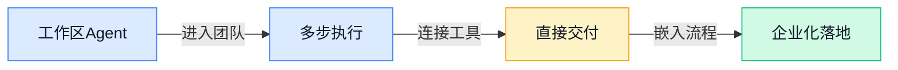
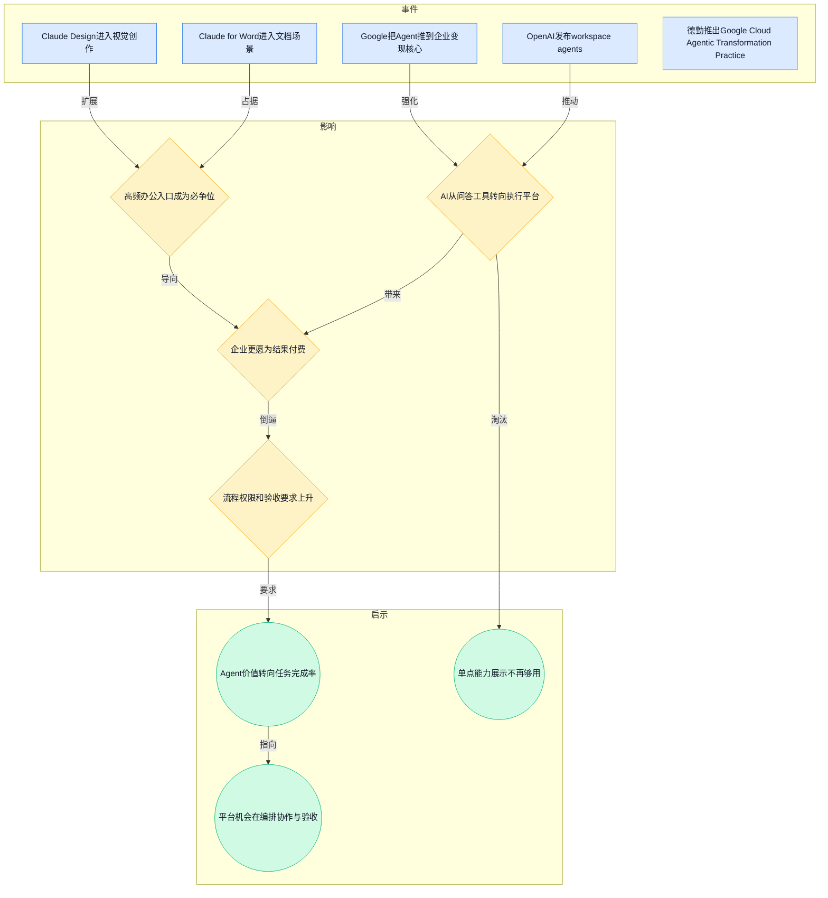
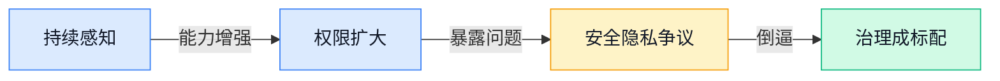
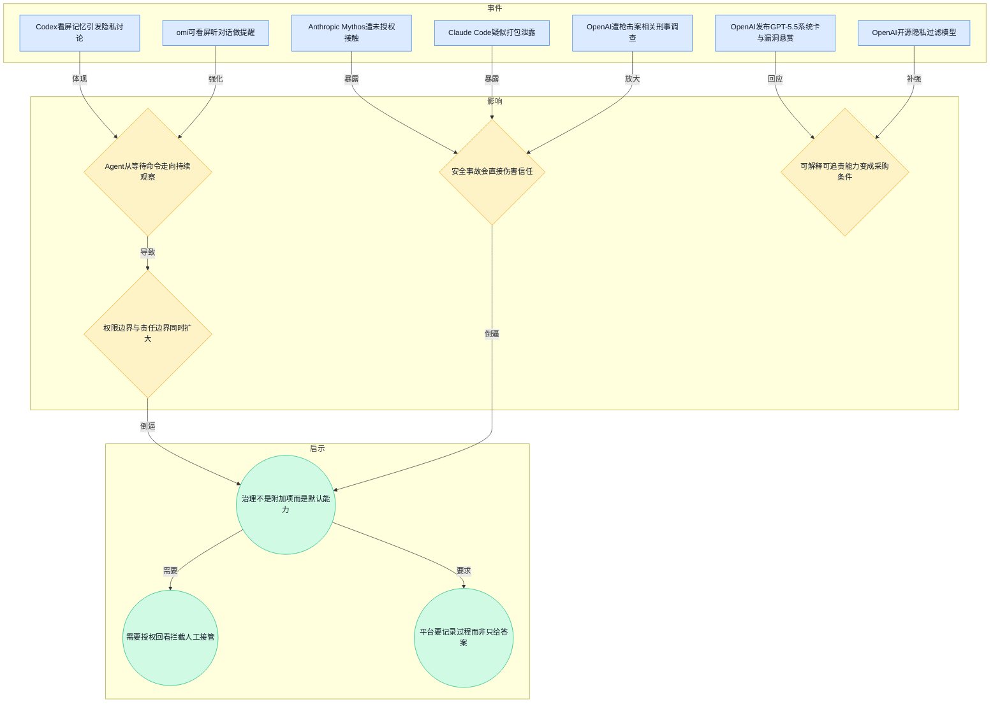
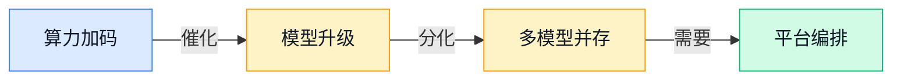
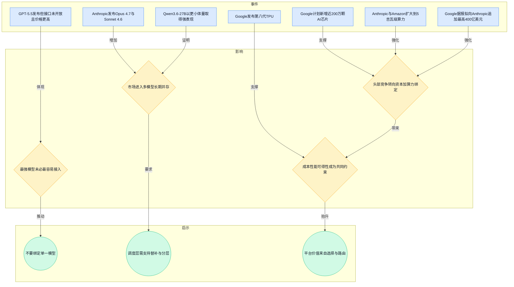
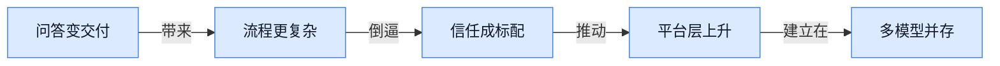
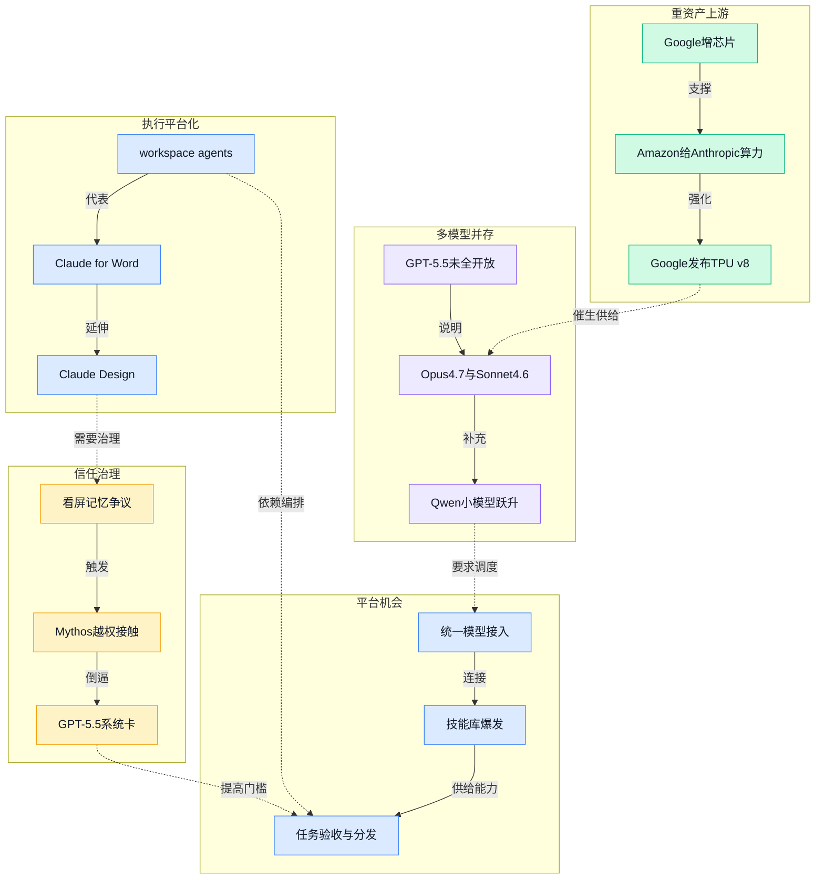

> 2026-04-20 ~ 2026-04-26 | 本周共 7 期日报

**本周日报**: [04-20](/en/ai-daily-site/2026/2026-04/2026-04-20/) | [04-21](/en/ai-daily-site/2026/2026-04/2026-04-21/) | [04-22](/en/ai-daily-site/2026/2026-04/2026-04-22/) | [04-23](/en/ai-daily-site/2026/2026-04/2026-04-23/) | [04-24](/en/ai-daily-site/2026/2026-04/2026-04-24/) | [04-25](/en/ai-daily-site/2026/2026-04/2026-04-25/) | [04-26](/en/ai-daily-site/2026/2026-04/2026-04-26/)

---

## 本周聚焦

### Agent从“会聊”进入“会交付”阶段

展开详细图谱

本周最值得串起来看的一条主线，是大厂几乎同时把 AI 从“回答问题”推向“完成工作”。4 月 23 日，OpenAI 推出 workspace agents（工作区智能代理，能在团队环境里自动执行一连串任务的 AI 助手），这是一个很强的信号：ChatGPT 不再只想做聊天窗口，而是开始争夺团队协作层。几乎同一时间，Google 被日报概括为“把 Agent 推到企业变现核心位置”，说明另一家头部玩家也不再把 Agent 当成展示能力的附属功能，而是当成收入增长抓手。

如果再往前看，4 月 20 日 Anthropic 上线 Claude for Word，4 月 20 日和 21 日连续强调 Claude Design，这些动作共同指向一个变化：AI 正在主动钻进用户原本就高频使用的文档、设计、办公环境里，而不是等用户专门打开一个独立聊天工具。谁能占住这些入口，谁就更有机会形成使用习惯、沉淀上下文（用户过去的任务背景和偏好信息）并建立付费关系。

为什么这件事重要？因为对企业和普通用户来说，真正愿意付钱的往往不是“模型更聪明一点”，而是“它能不能把事做完”。聊天工具时代，大家比较的是回答质量；交付工具时代，大家会开始比较任务成功率、跨工具协同能力、失败后回退能力、结果是否可复查。4 月 26 日德勤推出面向 Google Cloud 的 Agentic Transformation Practice（企业智能体转型服务团队），就进一步证明企业市场已经不满足于买一个模型接口，而是在买一整套“把 AI 接进业务流程”的方案。

对行业意味着什么？第一，Agent 赛道会从“炫技演示”转向“结果交付”。第二，办公入口和流程入口的价值正在抬升，文档、设计、研发、研究这些高频任务会成为主战场。第三，平台层机会反而更清晰：因为当所有上游都想做入口，真正稀缺的会是跨模型、跨工具、跨角色的协作编排与结果验收能力。对我们这种 Agent 调度与进化平台来说，这不是去和大厂正面比谁模型强，而是去解决“当多个 Agent 都能做事时，谁来选、谁来管、谁来兜底”的问题。

### 信任与治理从边缘议题变成入场券

展开详细图谱

本周另一条必须深拆的主线，是 Agent 能力增强的同时，安全、隐私、责任问题被快速推到台前，而且已经不是“学界讨论”，而是现实事故和产品动作同时发生。4 月 22 日，Codex 的“看屏记忆”功能引发隐私讨论；同一天，开源项目 omi 被描述为能看屏幕、听对话并给提醒。这说明 Agent 正从“等用户发指令”转向“持续感知环境再行动”。能力确实更强，但也意味着系统知道得更多、看到得更多、介入得更深。

风险面同样在扩大。4 月 20 日，Claude Code 疑似因打包失误泄露；4 月 23 日，Anthropic 的 Mythos 遭未授权用户突破；4 月 22 日和 26 日，OpenAI 还因现实案件中的责任边界问题受到调查与舆论压力。这些事件虽然性质不同，但共同揭示出一个事实：一旦 AI 从生成内容走向代办事务，出问题的后果就不再只是“答案不准”，而可能是权限泄露、行为失控、责任不清。

更值得注意的是，头部公司已经开始主动把治理做成产品组成部分。4 月 24 日，OpenAI 发布 GPT-5.5 System Card（系统卡，集中披露模型能力与风险的说明文件）和生物安全漏洞悬赏计划，同时推出开源隐私过滤模型。这个组合动作说明行业正在承认一个现实：效果好不等于可用，能部署到真实业务里还需要可控、可查、可追责。

为什么这件事重要？因为接下来用户和企业选择 Agent，不会只看它“厉不厉害”，而会越来越看“敢不敢托付”。特别是涉及持续观察、自动执行、多方协作的产品，若没有明确授权、过程留痕、风险提示、人工接管和权限隔离，再强的能力都可能因为一两次事故被打回原形。

对行业意味着什么？第一，治理会成为产品架构的一部分，而不是法务补丁。第二，平台型公司有机会把“信任基础设施”做成差异化能力，比如步骤记录、规则护栏（明确限制 AI 行为边界的规则系统）、异常回退、评价防刷。第三，未来真正值钱的不只是生成和执行能力，而是“让用户放心把任务交出去”的能力。对我们来说，这条线几乎是核心战场，因为我们的定位本来就不是单个 Agent，而是让用户选择、评价和信任 Agent。

### 算力绑定与模型多元化同时发生，平台层价值上升

展开详细图谱

本周第三条大线索，是大家表面在卷模型，底层其实在卷“谁能长期拿到芯片、电力、机房和分发权”，但与此同时，模型市场并没有走向单一垄断，反而更像多层次并存。4 月 21 日 Google 计划新增近 200 万颗 AI 芯片，并转向 Marvell 定制方案；同日 Anthropic 与 Amazon 扩大合作，瞄准最高 5 吉瓦级算力；4 月 25 日和 26 日又连续出现 Google 计划向 Anthropic 追加最高 400 亿美元的消息。资本、算力、生态绑定已经成为头部竞争的主轴。

但这并不等于“以后只剩一家模型可用”。相反，本周多个事件都在证明模型多元化会长期存在。4 月 24 日 GPT-5.5 发布，但官方暂未开放接口、价格还被报道明显提高；这说明“最强模型”未必“最好接入”。4 月 26 日 Anthropic 发布 Opus 4.7 和 Sonnet 4.6，继续细分不同档位；同日行业洞察还提到 Qwen3.6-27B 这类更小模型在代码基准测试中超过更大前代模型，意味着性价比路线仍然很有竞争力。

为什么这件事重要？因为对大多数创业公司、企业用户和普通用户来说，真正面对的不是“哪个模型全球第一”，而是“哪个模型此刻最适合这个任务、这个预算、这个风险等级”。有的任务追求最高准确率，有的追求速度，有的追求低成本，有的必须本地化或更强隐私。模型能力越来越像一个分层市场，而不是单一冠军市场。

对行业意味着什么？第一，上游会越来越重，下游反而更需要灵活。第二，多模型编排、能力抽象（把不同模型的差异封装成统一可调用能力）、智能分流会成为基础能力。第三，谁能把价格、时延（响应快慢）、质量、可用性和风险一起纳入路由逻辑，谁就更接近真实业务价值。对我们而言，这周的信息几乎是在重复同一句话：不要做“另一个模型”，要做“模型之上的选择与协作系统”。

---

## 信号与噪音

1. Anthropic 定价表面不变，但 Opus 4.7 的实际使用成本被曝更高。点评：这提醒市场别只看官方单价，要看真实任务链路里的 token（模型处理文本的计量单位）消耗和工具调用总成本，Agent 产品尤其如此。

2. Deezer 表示 44% 的新上传歌曲由 AI 生成，且多数播放量涉嫌造假。点评：内容供给爆炸并不自动带来价值，反而会加速平台把资源投入到鉴别、排序和反作弊，这和 Agent 市场未来的评价体系高度相似。

3. 德国法院裁定，AI 改编成漫画风格不一定侵犯原照片版权。点评：这不是“版权问题解决了”，而是说明司法正在尝试按具体生成方式切分责任，创作型 AI 的合规边界会越来越依赖场景细则而非一句总原则。

4. Google 称 75% 的新代码已有 AI 参与编写。点评：这说明 AI 编码已从试验工具变成默认工作流的一部分，但“参与编写”不等于“独立交付”，团队分工和质量把关反而会更重要。

5. Anthropic 承认 Claude Code 近期质量下滑，并表示将收紧发布把关。点评：头部厂商亲自证明了一个现实——模型再强，产品层的小失误也会迅速损害信任，这对所有依赖上游模型的团队都是预警。

6. Anthropic 的 Mythos AI 在 7 周内找出 2000 多个未知漏洞。点评：这说明强模型在高价值专业任务上开始显现真实生产力，但也意味着能力越强，权限控制和误报治理就越关键，否则价值会被风险抵消。

7. 阿联酋计划两年内让一半政府服务交给自主 Agent 运行。点评：无论最终完成度如何，这已是一个强烈政策信号：政府和大型组织正在把 Agent 当作制度级工具而非效率插件，行业讨论会随之从“能不能用”转向“怎么治理”。

---

## 宏观趋势

展开详细图谱

1. 趋势名称：AI 从问答界面走向执行平台。验证事件包括 OpenAI 的 workspace agents、Google 把 Agent 推向企业变现核心、Claude for Word 和 Claude Design 嵌入具体办公场景。未来走向是：谁掌握高频任务入口，谁就更可能占据用户关系，但真正胜负会落在执行稳定性和结果验收上。

2. 趋势名称：信任治理成为产品默认配置。验证事件包括 Codex 看屏记忆引发隐私争议、Mythos 遭未授权接触、Claude Code 疑似泄露、OpenAI 发布 GPT-5.5 系统卡和漏洞悬赏。未来走向是：授权、留痕、可回看、可接管会从“企业版特性”变成主流产品标配。

3. 趋势名称：上游竞争重资产化，下游机会平台化。验证事件包括 Google 增加 AI 芯片、Anthropic 绑定 Amazon 5 吉瓦级算力、Google 拟追加高额投资、Google 发布第八代 TPU。未来走向是：头部基础模型公司会越来越像“资本+算力+生态联合体”，创业公司更适合在跨模型编排、行业工作流和信任层构建价值。

4. 趋势名称：模型市场长期多元并存。验证事件包括 GPT-5.5 强但未全面开放、Anthropic 同周发布多个档位模型、Qwen3.6-27B 以更小规模取得强表现，以及开源社区大量出现模型统一接入和智能分流工具。未来走向是：用户不会只用一个模型，调度、分层和替补机制会成为上层产品竞争力的重要组成部分。

---

## 对我们的启发

产品方向：第一，应优先把“任务完成率、失败回退、人工接管、过程回看”做成基础能力，因为本周多起事件都说明用户要的不只是答案，而是可托付的执行。第二，可强化“角色化 Agent 模板 + 技能市场 + 结果验收”，让普通用户先从清晰岗位任务入手，而不是面对抽象 Agent 自己拼装。

竞争策略：第一，不和上游模型正面竞争，继续坚持模型无关编排，把不同模型、不同技能、不同成本档位路由成统一体验。第二，把信任机制当成产品卖点，而不是内部能力，例如可信评价、防刷、步骤记录、权限分级，这正是未来噪音市场里最稀缺的部分。

时机判断：第一，Agent 市场正在从“能演示”向“能交付”过渡，说明现在适合抢占平台心智，但不适合夸大自动化能力。第二，上游仍在快速变化，单押一家风险很高，越早建立多模型替补和分层策略，越能减少被模型发布节奏牵着走。

---

## 本周思考

当越来越多 Agent 能替用户做事时，用户真正会信任的，到底是“最强的 Agent”，还是“最可解释、最可控、最容易被纠错的 Agent”？如果答案是后者，那下一轮竞争的核心也许根本不是智商，而是治理。
